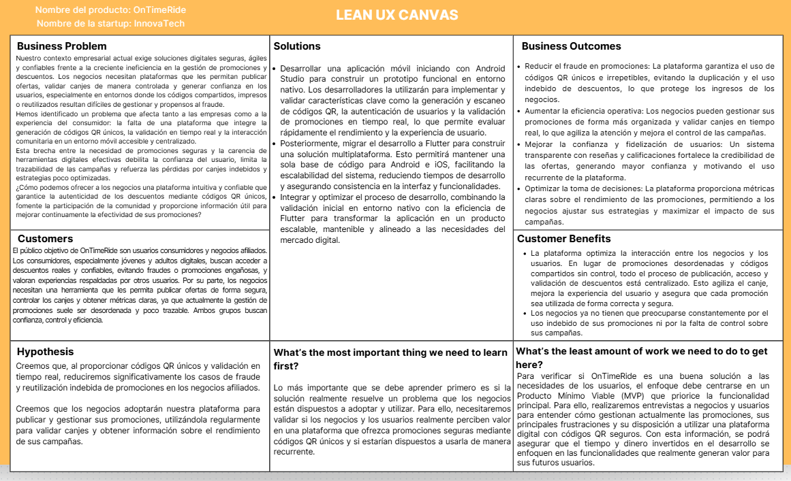

# Capitulo I: Presentacion

## 1.1. Startup Profile

Somos QRust, interesados en el desarrollo de una plataforma móvil que conecta empresas y consumidores mediante descuentos digitales únicos, seguros y verificables, potenciada por una comunidad social que genera confianza orgánica.

Buscamos cerrar la brecha entre la experiencia física de compra y la conveniencia digital, con campañas medibles para negocios y canjes simples para usuarios, priorizando anti-fraude.

### 1.1.1. Descripción de la Startup

  <table style="width:95%; max-width:900px; border-collapse:collapse; font-family:Arial, sans-serif; font-size:14px;">
    <caption style="caption-side:top; text-align:left; font-weight:bold; margin-bottom:8px;">
      Misión, Visión y Valores — **Producto:** Klippr (sistema móvil de gestión de descuentos con comunidad social)
    </caption>
    <thead>
      <tr>
        <th style="background:#222; color:#fff; padding:12px; border:1px solid #ccc; text-align:left;">Misión</th>
        <th style="background:#222; color:#fff; padding:12px; border:1px solid #ccc; text-align:left;">Visión</th>
        <th style="background:#222; color:#fff; padding:12px; border:1px solid #ccc; text-align:left;">Valores</th>
      </tr>
    </thead>
    <tbody>
      <tr>
        <td style="padding:12px; border:1px solid #ddd; vertical-align:top;">
          <ul style="margin:0; padding-left:18px;">
            <li>Reducir fraude y reutilización de promociones con códigos QR únicos y bloqueo automático post-canje.</li>
            <li>Aumentar la confianza del consumidor con reseñas, calificaciones y recomendaciones en tiempo real.</li>
            <li>Entregar trazabilidad y analítica por campaña para que las empresas optimicen inversión y resultados.</li>
          </ul>
        </td>
        <td style="padding:12px; border:1px solid #ddd; vertical-align:top;">
          <ul style="margin:0; padding-left:18px;">
            <li>Ser un ecosistema de confianza digital entre negocios y consumidores, donde seguridad, comunidad y datos trabajen juntos en cada transacción.</li>
          </ul>
        </td>
        <td style="padding:12px; border:1px solid #ddd; vertical-align:top;">
          <ul style="margin:0; padding-left:18px;">
            <li><strong>Integridad y anti-fraude:</strong> unicidad del código, validación en tiempo real e invalidación tras uso.</li>
            <li><strong>Transparencia:</strong> condiciones claras, historial y métricas visibles para usuarios y empresas.</li>
            <li><strong>Comunidad:</strong> feedback de pares como motor de descubrimiento y marketing orgánico.</li>
            <li><strong>Simplicidad:</strong> flujo corto: publicar, generar QR, canjear, reseñar, sin fricción innecesaria.</li>
          </ul>
        </td>
      </tr>
    </tbody>
  </table>

 

### 1.1.2. Perfiles de integrantes del equipo

 

<table>
  <thead>
    <tr>
      <th>Integrantes</th>
      <th width="200">Foto</th>
      <th>Descripción del perfil</th>
    </tr>
  </thead>
  <tbody>
    <tr>
      <td>Bonifacio Jaramillo, Samuel Jesus (U202317269)</td>
      <td align="center">
        
      </td>
      <td>Estudiante de Ing.Software. Experiencia desarrollando aplicaciones móviles con Kotlin & Dart. Apasionado por AI Tooling, Prompt Engineering y Desarrollo de Workflows/Automatizaciones con Claude.</td>
    </tr>
    <tr>
      <td>Castro Pariona, Jefferson Ernesto (U201822823)</td>
      <td align="center">
        
      </td>
      <td>Soy estudiante de Ingeniería de Software. Me caracterizo por ser una persona motivadora dentro de los equipos y por tener una fuerte orientación al trabajo colaborativo.</td>
    </tr>
    <tr>
      <td>Ponce Perales, Alberto Alejandro (U202320684)</td>
      <td align="center">
        
      </td>
      <td>Actualmente estudiante de la carrera profesional de Ingeniería de Software y explorando el mundo de la programación con Java, C++ y C#. Estoy iniciando mi camino en el desarrollo de apps móviles y me entusiasma encontrar formas de hacer los flujos de trabajo más eficientes. Con ganas de aprender y aportar en proyectos de software.</td>
    </tr>
    <tr>
      <td>Guillen Galindo, Julio Adolfo (U20241A352)</td>
      <td align="center">
        
      </td>
      <td></td>
    </tr>
    <tr>
      <td>Alejandro Manuel Galindo Montero (U202321264)</td>
      <td align="center">
        
      </td>
      <td>Mi nombre es Alejandro Manuel Galindo Montero, tengo 21 años y curso la carrera de Ingeniería de Software. Me considero una persona creativa y responsable. En mis tiempos libres me gusta aprender cosas nuevas. En este proyecto apoyaré con todos los conocimientos que he adquirido en los últimos años.</td>
    </tr>
  </tbody>
</table>

## 1.2. Solution Profile

### 1.2.1. Antecedentes y problemática

El comercio digital en América Latina ha crecido de forma sostenida, lo que aumenta la demanda de herramientas que conecten la experiencia física de compra con la conveniencia digital. Aun así, muchas soluciones de cupones y promociones siguen presentando fallas estructurales: **códigos compartidos en redes sociales**, **impresiones o duplicados** y **poca retroalimentación real** del consumidor.

En este contexto, **QRust** plantea **Klippr** como un sistema móvil donde las empresas publican promociones y descuentos, los usuarios los redimen con un **código QR único e irrepetible** y la **comunidad** valida y amplifica las mejores ofertas mediante reseñas, calificaciones y recomendaciones en tiempo real. 

**Problema central:** el mercado de promociones sufre tres fricciones: (1) **fraude y reutilización** de cupones físicos o códigos compartibles; (2) **falta de confianza** ante ofertas sin respaldo de experiencias reales; (3) **escasa trazabilidad** para saber qué campañas funcionan y cuántos canjes ocurren. La propuesta aborda esas tres brechas con un enfoque **digital, social y seguro**.

# Problemática — Análisis 5W2H

## Who — ¿Quiénes están involucrados?
- **Usuario consumidor** (18–45 años) que busca descuentos en restaurantes, tiendas, servicios y entretenimiento desde el smartphone.
- **Empresa / negocio afiliado** (PYMEs, retail, servicios locales) que necesita campañas medibles y protección frente a canjes no controlados.
- **Administrador de plataforma** que verifica negocios, vigila abusos y configura el ecosistema.
- **QRust** como responsable del producto, operación y evolución del MVP.

---

## What — ¿Qué problema se busca resolver?

Se busca superar la fragmentación entre **promoción**, **canje seguro** y **prueba social**. Sin una solución integrada aparecen:

- Pérdida de margen por **canjes fraudulentos** o duplicados.
- **Baja confianza** del consumidor cuando no hay evidencia de experiencias de pares.
- **Campañas “ciegas”** para la empresa: poca visibilidad de vistas, conversiones y satisfacción.

---

## Where — ¿Dónde ocurre?

- Canales digitales y físicos donde hoy circulan cupones (redes sociales, impresos, mensajes).
- **Puntos de venta** donde el usuario debe mostrar un beneficio y la empresa debe validarlo rápidamente.
- Regiones con alta adopción móvil y crecimiento del comercio digital en **América Latina** (enfoque inicial alineado al MVP).

---

## When — ¿Cuándo ocurre?

- De forma continua en campañas estacionales, lanzamientos y “días de promoción”.
- Se acentúa cuando los códigos se **viralizan sin control** o cuando el negocio no puede **auditar** canjes en tiempo real.

---

## Why — ¿Por qué ocurre?

- Los modelos tradicionales suelen basarse en **códigos reutilizables o físicos** difíciles de auditar.
- Hay **poco anti-fraude** sistemático frente a duplicidad y reuso.
- Muchas apps son **monederos de descuentos** sin una **comunidad** integrada que genere confianza.
- La **digitalización de PYMEs** requiere herramientas **accesibles** y de **rápida implementación** (autogestión desde la app).

---

## How — ¿Cómo se manifiesta el problema?

- El consumidor desconfía o abandona la oferta si el proceso es confuso o parece “demasiado bueno para ser verdad”.
- La empresa no distingue entre **interés real** y **canje válido**, ni relaciona resultados con **feedback** cualitativo.
- Operaciones manuales (listas, sellos, hojas) elevan errores y tiempos de validación.

---

## How Much — ¿Cuánto impacta?

- El impacto económico se expresa en **márgenes erosionados** por canjes no controlados y en **costo de adquisición** alto cuando la promoción no genera confianza.
- El MVP documenta como referencia de éxito social que las promociones con **reseñas positivas** pueden generar **hasta 3× más canjes** que las que no cuentan con retroalimentación (indicador orientador para priorizar el módulo social).

---

La ausencia de una plataforma que combine **gestión de descuentos seguros**, **QR único anti-fraude** y **comunidad** dificulta escalar promociones con confianza y métricas. **QRust**, a través de **Klippr**, propone un MVP funcional que cierra el ciclo de valor con validación en punto de venta, historial y analítica para empresas y administración.

## 1.2.2. Lean UX Process

En esta sección aplicamos el **Lean UX Process** (Gothelf & Seiden, 3rd Edition).  
Se presenta: **Problem Statement**, **Assumptions**, **Hypothesis Statements** y el **Lean UX Canvas**, adaptados al proyecto **WeTech** (micromovilidad eléctrica compartida + IoT).

---
### 1.2.2.1. Lean UX Problem Statements

**Context (Contexto)**  
En América Latina crece la demanda de herramientas que conecten compra física y conveniencia digital. Las soluciones de cupones suelen sufrir **códigos compartidos**, **duplicidad** y **poca retroalimentación real**, lo que erosiona márgenes y confianza.

**Problem (Problema)**  
No hay una solución integrada, simple para PYMEs y robusta para usuarios que combine: **publicación de campañas**, **QR único por usuario/oferta**, **validación en tiempo real**, **bloqueo post-canje**, **reseñas y comunidad**, y **analítica por campaña** en un mismo producto.

**Impact (Impacto esperado)**  
Sin integración: fraude/reuso, desconfianza y campañas difíciles de medir. Con **Klippr** se espera aumentar canjes exitosos, mejorar confianza mediante prueba social y dar visibilidad operativa (canjes, vistas, ratings) a empresas y administración.

**Measure of success (Criterios de éxito)**  
- Disponibilidad media de la flota ≥ 85% en zonas objetivo.  
- Incremento de la utilización por vehículo ≥ 20% en 12 semanas.  
- Reducción de incidentes operativos (robos/fallas) ≥ 30% tras despliegue de IoT y procesos.  
- Satisfacción de usuarios (NPS o encuesta) ≥ 60.

---

### 1.2.2.2. Lean UX Assumptions

> Las assumptions se agrupan en: Business, User, Value, Feature.

**a) Business Assumptions**  
- PYMEs y negocios locales adoptarán el canal si pueden **autogestionar** campañas desde la app con costo de implementación bajo.  
- Un modelo basado en volumen de canjes y visibilidad (y expansiones futuras como suscripción premium) puede sostener el negocio.  
- El **anti-fraude** (QR + bloqueo) reduce pérdidas y hace atractiva la migración desde cupones informales.

**b) User Assumptions**  
- Personas de **18–45 años** usarán la app si el feed + filtros + geolocalización les permiten **descubrir** ofertas relevantes rápidamente.  
- Mostrar **rating promedio** y reseñas antes de activar aumenta intención de canje.  
- La experiencia post-canje (invitar a reseñar) es aceptable si el flujo es corto y claro.

**c) Value Assumptions**  
- Un **QR único** vinculado a cuenta y promoción aumenta confianza frente a códigos genéricos.  
- Las promociones con **reseñas positivas** pueden multiplicar canjes respecto a ofertas sin retroalimentación (hipótesis de diseño a validar con datos).  
- **Notificaciones push** de ofertas relevantes aumentan retorno al feed sin percibirse como spam (segmentación y preferencias).

**d) Feature Assumptions**  
- **Feed con filtros** (categoría, ubicación, empresa, %, vigencia) + **detalle con reseñas** aumenta activación de descuentos.  
- **Escanear QR** + **ingreso manual** cubren la variabilidad de puntos de venta.  
- **Panel admin** + verificación de empresas es necesario para escalar con bajo riesgo de abuso.

---

### 1.2.2.3. Lean UX Hypothesis Statements

> Cada hipótesis sigue el patrón: *We believe... / We will know this is true when...*

**a) Business Hypothesis**  
We believe that **QRust** logrará retención de negocios si las campañas muestran analítica accionable (canjes, vistas, ratings) y reducen fraude vs. cupones tradicionales.  
**We will know this is true when:** empresas activas publican **≥ 2** campañas en promedio en las primeras semanas y reportan **menos disputas** por reuso vs. métodos previos (entrevista + datos).

**b) User Hypothesis**  
We believe that users will complete redemption if **QR validation** feels instant and the “Mis descuentos” section is trustworthy.  
**We will know this is true when:** **más del 95%** de canjes exitosos, tiempo de validación **menor a 3 segundos** en condiciones de prueba, y tasa de abandono post-activación QR baja semana a semana.

**c) Value Hypothesis**  
We believe that social proof (reviews + comments + likes) increases conversion from view “Obtener descuento”.  
**We will know this is true when:** ofertas con reseñas muestran mayor tasa de generación de QR vs. ofertas sin reseñas, manteniendo vigencia comparable.

**d) Feature Hypothesis**  
We believe that building the **core loop** (publicar, generar QR, escanear/validar, bloquear y reseñar) + **dashboard empresa/admin** is sufficient for a 12-week MVP.  
**We will know this is true when:** usuarios y empresas completan el flujo extremo a extremo en pruebas beta sin pasos alternativos “fuera de la app” críticos.

---

### 1.2.2.4. Lean UX Canvas

**Resumen:**  
El Lean UX Canvas integra negocio, usuario, hipótesis y experimentos para validar **Klippr** como plataforma de descuentos con **QR anti-fraude** y **comunidad**. El roadmap de referencia del MVP propone **12 semanas** en fases: fundación, core de descuentos, módulo social, dashboards/analytics y QA/lanzamiento.

<figure style="page-break-inside: avoid; text-align: center;">
  
  <figcaption style="font-size: 0.9em; color: #555;">
    <strong>Figura 1:</strong> Lean UX Canvas.
  </figcaption>
</figure>

---

#### 1. Business Problem
Las promociones digitales y físicas frecuentemente carecen de **unicidad**, **control post-canje** y **prueba social integrada**. Las empresas necesitan campañas **medibles**; los usuarios necesitan **confianza** y canje **rápido** en tienda.

---

#### 2. Users / Customers (Initial Segment)
- **B2C — Usuario consumidor:** 18–45 años, uso intensivo de smartphone, interés en restaurantes, retail, servicios y entretenimiento.  
- **B2B — Empresa afiliada:** PYMEs y negocios locales (incl. retail y servicios) que buscan atraer clientes con campañas trazables.  
- **Admin de plataforma:** verificación, categorías, reportes de abuso/fraude y parámetros globales.

---

#### 3. User Needs / Pain Points
- Desconfianza por códigos compartidos o poco claros.  
- Fricción al canjear (colas, validación lenta, ambigüedad de condiciones).  
- Falta de evidencia de experiencias recientes (reviews, rating visible).  
- Para negocios: poca visibilidad de **vistas vs. canjes**, horarios pico y satisfacción.

---

#### 4. Value Proposition / Solution Ideas
- **QR único** por usuario/oferta + **bloqueo automático** tras canje.  
- **Feed** con filtros, **geolocalización** y **búsqueda** (empresa, categoría, %, vigencia).  
- **Módulo social:** reseñas (1–5), comentarios, likes, notificaciones de actividad; empresa **responde** reseñas.  
- **Dashboard empresa** y **panel admin** con métricas y moderación.

---

#### 5. Assumptions (Negocio, Usuario, Tecnología)
- La autogestión desde la app reduce barrera de adopción para PYMEs.  
- La verificación de empresas y categorías administradas mejoran calidad del marketplace.  
- Un backend con estados de código (**pendiente,utilizado**) y reglas anti-doble-canje es central para credibilidad.

---

#### 6. Hypothesis Statements
- **Usuario:** Si el detalle de oferta muestra condiciones + rating + reseñas, aumentará la activación del descuento.  
- **Valor:** Si el canje es validado en **menos de 3 segundos** y el QR queda bloqueado, sube la confianza percibida.  
- **Negocio:** Si el dashboard muestra canjes/vistas/ratings, las empresas repetirán campañas.  
- **Feature:** Priorizar el **ciclo completo** (compartir en redes, premium, API POS, gamificación, BI avanzado, chat).

---

#### 7. Experiments / MVP Plan
- Construir MVP con **18 funcionalidades core** del documento (registro/login, perfiles, feed, promoción, QR, escaneo/manual, bloqueo, historial, dashboard, reseñas, likes/comentarios, push, geo, filtros, panel admin, respuesta a reseñas).  
- Dejar expansiones explícitas para versiones posteriores (p. ej., compartir oferta, premium, API pública, gamificación, analytics avanzado, chat).  
- Beta con primeros usuarios y negocios; entrevistas + pruebas de usabilidad en punto de venta simulado.

---

#### 8. Success Metrics (Métricas de Éxito)
- Empresas activas, usuarios activos, canjes, reseñas (objetivos del MVP mes 1–3).  
- Tasa de canje exitoso **superior al 95%**.  
- Tiempo de validación QR **menor a 3 segundos** (mejorar hacia **menor a 1 segundo** en escala).  
- Rating app **≥ 4.0** estrellas en etapa inicial.

---

#### 9. Risks & Mitigations
- **Riesgo:** intentos de reuso o suplantación de códigos.  
  **Mitigación:** UUID + firma HMAC server-side, rechazo de doble uso, alertas a admin, expiración configurable del QR.  
- **Riesgo:** reseñas falsas / abuso.  
  **Mitigación:** reseña ligada a canje completado, reportes, moderación admin.  
- **Riesgo:** baja oferta inicial (poco inventario de promociones).  
  **Mitigación:** pilotos focalizados por vertical (p. ej., restaurantes) y onboarding asistido.  
- **Riesgo:** dependencia de permisos de cámara/GPS/notificaciones.  
  **Mitigación:** alternativas UX claras (manual, búsqueda sin GPS si aplica) y explicación de valor por permiso.

---

<table style="border-collapse:collapse; width:100%; max-width:1200px; margin:24px auto; font-family:Arial, Helvetica, sans-serif; font-size:13px;">
  <thead>
    <tr>
      <th style="border:1px solid #ddd; padding:12px; text-align:center; width:28%;">Bloque del Lean UX Canvas</th>
      <th style="border:1px solid #ddd; padding:12px; text-align:center; width:72%;">Contenido (Klippr — MVP descuentos)</th>
    </tr>
  </thead>
  <tbody>
    <tr>
      <td style="border:1px solid #ddd; padding:12px; vertical-align:top;"><strong>1. Business Problem</strong></td>
      <td style="border:1px solid #ddd; padding:12px; vertical-align:top;">
        Cupones y promociones se comparten sin control, se duplican y generan poca señal de confianza. Falta una solución integrada con QR único, bloqueo post-canje, comunidad (reseñas/ratings) y analítica por campaña para PYMEs y usuarios móviles.
      </td>
    </tr>
    <tr>
      <td style="border:1px solid #ddd; padding:12px; vertical-align:top;"><strong>2. Users / Customers (Initial Segment)</strong></td>
      <td style="border:1px solid #ddd; padding:12px; vertical-align:top;">
        <ul style="margin:0; padding-left:16px;">
          <li><strong>B2C:</strong> Personas 18–45 años que consumen ofertas en restaurantes, retail, servicios y entretenimiento.</li>
          <li><strong>B2B:</strong> PYMEs y negocios locales que publican campañas medibles y requieren validación en punto de venta.</li>
        </ul>
      </td>
    </tr>
    <tr>
      <td style="border:1px solid #ddd; padding:12px; vertical-align:top;"><strong>3. User Needs / Pain Points</strong></td>
      <td style="border:1px solid #ddd; padding:12px; vertical-align:top;">
        Desconfianza por códigos genéricos, fricción al canjear, poca evidencia social previa al uso, y para negocios: poca trazabilidad de vistas, canjes y satisfacción por campaña.
      </td>
    </tr>
    <tr>
      <td style="border:1px solid #ddd; padding:12px; vertical-align:top;"><strong>4. Value Proposition / Solution Ideas</strong></td>
      <td style="border:1px solid #ddd; padding:12px; vertical-align:top;">
        Feed con filtros y geolocalización, generación de QR único, escaneo o código manual en tienda, bloqueo automático, historial, reseñas/likes/comentarios, push, dashboards de empresa y panel admin.
      </td>
    </tr>
    <tr>
      <td style="border:1px solid #ddd; padding:12px; vertical-align:top;"><strong>5. Assumptions</strong></td>
      <td style="border:1px solid #ddd; padding:12px; vertical-align:top;">
        Autogestión atractiva para PYMEs; prueba social aumenta conversión; anti-fraude reduce pérdidas; verificación y moderación habilitan crecimiento con calidad.
      </td>
    </tr>
    <tr>
      <td style="border:1px solid #ddd; padding:12px; vertical-align:top;"><strong>6. Hypothesis Statements</strong></td>
      <td style="border:1px solid #ddd; padding:12px; vertical-align:top;">
        Hipótesis sobre descubrimiento con feed+filtros+rating; validación rápida aumenta confianza; pilotos por vertical validan oferta; reseñas post-canje alimentan descubrimiento social.
      </td>
    </tr>
    <tr>
      <td style="border:1px solid #ddd; padding:12px; vertical-align:top;"><strong>7. Experiments / MVP Plan</strong></td>
      <td style="border:1px solid #ddd; padding:12px; vertical-align:top;">
        MVP en 12 semanas (fundación, core QR, social, dashboards, QA). Beta con usuarios/negocios reales; métricas de canje, reseñas y tiempos de validación; entrevistas y pruebas en flujo de tienda.
      </td>
    </tr>
    <tr>
      <td style="border:1px solid #ddd; padding:12px; vertical-align:top;"><strong>8. Success Metrics</strong></td>
      <td style="border:1px solid #ddd; padding:12px; vertical-align:top;">
        Empresas activas, usuarios activos, canjes y reseñas según metas del MVP; canjes exitosos superior al 95%; validación QR menor a 3 segundos; rating app al menos 4.0.
      </td>
    </tr>
    <tr>
      <td style="border:1px solid #ddd; padding:12px; vertical-align:top;"><strong>9. Risks & Mitigations</strong></td>
      <td style="border:1px solid #ddd; padding:12px; vertical-align:top;">
        <strong>Fraude/reuso:</strong> UUID + HMAC, estados de código, alertas admin, expiración configurable. 
        <strong>Abuso en reseñas:</strong> canje previo, reportes y moderación. 
        <strong>Baja oferta/demanda:</strong> pilotos verticales y onboarding asistido. 
        <strong>Permisos móviles:</strong> alternativas (manual, búsqueda) y mensajes de valor por permiso.
      </td>
    </tr>
  </tbody>
</table>

## 1.3. Segmentos objetivo.

### Segmentación de Usuarios — QRust 

El MVP de **Klippr** se enfoca en dos segmentos complementarios del documento de producto: **usuarios finales** que descubren y canjean descuentos desde el móvil, y **empresas afiliadas** que publican campañas con condiciones y límites de canje. Esta segmentación permite validar el ciclo **publicar, generar QR, canjear y reseñar** y priorizar confianza (anti-fraude + comunidad).

---

### 1. Jóvenes y adultos

Conformado por **personas de 18 a 45 años** que buscan **aprovechar descuentos** en **restaurantes, tiendas, servicios y entretenimiento** desde su **smartphone**, con alta probabilidad de uso de apps, notificaciones y geolocalización para descubrir ofertas cercanas.

### **Características demográficas y tecnológicas**
- Edad objetivo **18–45 años**, con foco en adopción móvil y hábitos de consumo omnicanal.
- Alta familiaridad con **feed**, **filtros**, **reseñas** y **pagos/descuentos** digitales.
- Smartphone como canal principal de descubrimiento y de **presentación del QR** en tienda.

### **Necesidades y comportamientos**
- Explorar ofertas por **categoría**, **ubicación** o **empresa**, y entender **condiciones** antes de activar.
- Obtener un **QR único** por promoción, con claridad de vigencia y estado (pendiente / utilizado).
- Después del canje, participar del **módulo social** (calificación 1–5, texto, likes/comentarios) y recibir **notificaciones** de actividad relevante.

### **Sustento (según el MVP)**
- El comercio digital en **América Latina** impulsa la expectativa de experiencias físicas conectadas a apps.  
- La **prueba social** (reseñas y ratings visibles) es un diferenciador frente a cupones “no verificados” por la comunidad.  
- El MVP define **KPIs** orientadores (usuarios activos, canjes, reseñas, tasa de éxito de canje, tiempo de validación).

Este segmento permite validar descubrimiento, generación de QR, canje en punto de venta y retroalimentación comunitaria.

---

### 2. Empresas afiliadas 

Compuesto por **PYMEs, restaurantes, cadenas retail, servicios locales y negocios** que desean **atraer clientes** con **campañas medibles** y **menor riesgo de fraude**, publicando promociones con **porcentaje o monto**, **fechas**, **condiciones** y **límite de canjes**.

### **Características del negocio**
- Operación con **punto de venta** donde se validará el beneficio mediante **escaneo de QR** o **ingreso manual** de código.
- Necesidad de **dashboard** con campañas activas, **analítica** (canjes, vistas, calificaciones) y capacidad de **pausar/editar** campañas.
- Interacción con reputación: **responder reseñas** de forma pública.

### **Necesidades y comportamientos**
- Verificación/registro de empresa y **perfil** con **logo**, **categoría** y datos que habiliten confianza (incluye flujo de **aprobación por administrador** en el MVP).
- Creación de campañas con reglas claras para el usuario y trazabilidad para la empresa.
- Uso del **panel de validación** en tienda como parte operativa del día a día.

### **Sustento**
- Motivación explícita del MVP: **pérdida de márgenes** por canjes no controlados y **falta de retroalimentación** real del consumidor en soluciones tradicionales.  
- La propuesta de valor incluye **trazabilidad total** del canje y **simplicidad de adopción** (autogestión desde la app).  
- Las empresas con múltiples promociones simultáneas se benefician de un **repositorio único** de métricas por campaña.

Este segmento es clave para asegurar inventario de ofertas, calidad del marketplace y aprendizaje continuo sobre qué campañas funcionan.

---
