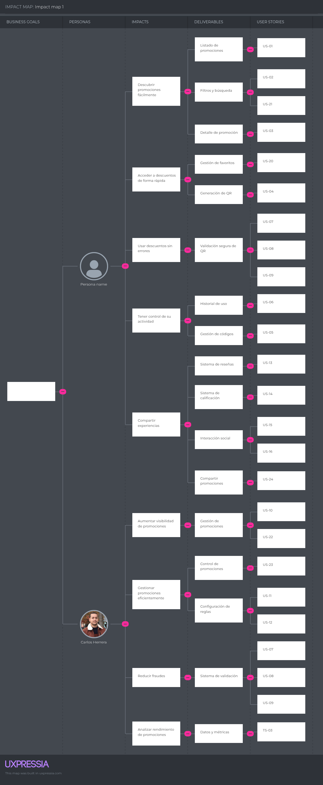
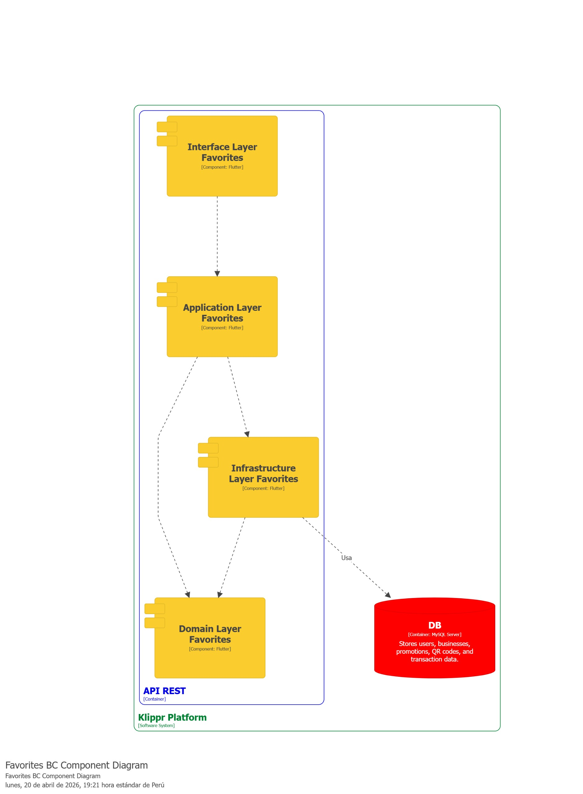
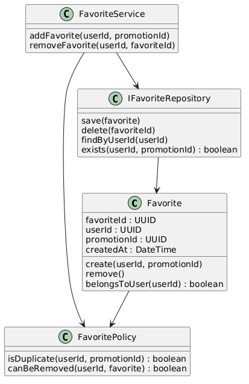
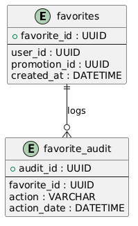

# Capítulo II: Requirements Elicitation & Analysis

## 2.1. Competidores.
### 2.1.1. Análisis competitivo.
<table>
    <tr>
      <th colspan="6">Competitive Analysis Landscape — Plataformas de ofertas, cupones y descuentos</th>
    </tr>
    <tr>
      <td colspan="1">¿Por qué llevar a cabo el análisis?</td>
      <td colspan="5">Permite ubicar a <strong>Klippr</strong> frente a modelos de descuentos masivos, marketplaces y agregadores, identificar brechas (fraude, prueba social, trazabilidad por campaña) y definir tácticas de diferenciación coherentes con el MVP.</td>
    </tr>
    <tr>
      <td colspan="2"></td>
      <td><strong>Groupon</strong> <em>(referencia de mercado)</em></td>
      <td><strong>Rappi</strong> <em>(superapp + promos)</em></td>
      <td><strong>PedidosYa</strong> <em>(delivery + descuentos)</em></td>
      <td><strong>Cuponatic</strong> <em>(cupones y ofertas digitales)</em></td>
    </tr>
    <tr>
      <td rowspan="2">Perfil</td>
      <td>Overview</td>
      <td>Marketplace de ofertas y experiencias con amplia oferta y compra anticipada del cupón/descuento.</td>
      <td>App de delivery y servicios con secciones de promociones, clubes y campañas según ciudad y marca.</td>
      <td>Plataforma de pedidos en línea donde restaurantes y retail publican descuentos ligados a compras por la app.</td>
      <td>Sitio/app orientada a cupones y promociones con enfoque editorial y descuentos por categoría.</td>
    </tr>
    <tr>
      <td>Ventaja competitiva ¿Qué valor ofrece a los clientes?</td>
      <td>Gran inventario de ofertas, reconocimiento de marca y descuentos agresivos en rubros variados.</td>
      <td>Alcance regional, hábito de uso recurrente y bundling con otros servicios (envío, pagos, etc.).</td>
      <td>Conveniencia inmediata: descuentos dentro del flujo de compra de comida y retail express.</td>
      <td>Curación de ofertas y búsqueda por categoría; foco en “encontrar cupones” rápidamente.</td>
    </tr>
    <tr>
      <td rowspan="2">Perfil de Marketing</td>
      <td>Mercado Objetivo</td>
      <td>Usuarios masivos que buscan ofertas puntuales y compras con descuento en múltiples verticales.</td>
      <td>Usuarios urbanos que ya consumen delivery y activan promociones por push o secciones de beneficios.</td>
      <td>Clientes de delivery y quick-commerce en distritos con cobertura de reparto.</td>
      <td>Usuarios price-sensitive que comparan cupones antes de comprar online o en retail asociado.</td>
    </tr>
    <tr>
      <td>Estrategias de Marketing</td>
      <td>Email marketing, campañas por temporada, partnerships con marcas y presencia SEO fuerte.</td>
      <td>Notificaciones, banners in-app, alianzas con marcas y mecánicas de fidelización.</td>
      <td>Promociones flash, combos, cupones first-order y programas por restaurante.</td>
      <td>Tráfico web, redes sociales y newsletters con ofertas destacadas del día.</td>
    </tr>
    <tr>
      <td rowspan="3">Perfil de Producto</td>
      <td>Productos y Servicios</td>
      <td>Compra de vouchers/ofertas; redención según reglas de cada campaña y comercio afiliado.</td>
      <td>Descuentos y beneficios dentro de un ecosistema amplio (no exclusivamente “cuponera”).</td>
      <td>Descuentos asociados a pedidos; foco en canales digitales de restaurantes/tiendas adheridas.</td>
      <td>Catálogo de cupones/códigos; experiencia centrada en descubrimiento y compra del beneficio.</td>
    </tr>
    <tr>
      <td>Precios y Costos</td>
      <td>Modelo comercial por comisión/participación en la oferta; precio final variable por categoría.</td>
      <td>Descuentos financiados por marcas/plataforma; costos ligados a suscripción o dinámica de marketplace.</td>
      <td>Promos como palanca de adquisición; estructura de comisiones al comercio.</td>
      <td>Ofertas con precios promocionales; mix de modelos por afiliación y publicidad.</td>
    </tr>
    <tr>
      <td>Canales de distribución (Web y/o Móvil)</td>
      <td>Web y app móvil.</td>
      <td>App móvil y web.</td>
      <td>App móvil y web.</td>
      <td>Web y presencia móvil (según mercado).</td>
    </tr>
    <tr>
      <td rowspan="4">Análisis SWOT</td>
      <td>Fortalezas</td>
      <td>Marca reconocida, volumen de ofertas, procesos maduros de compra.</td>
      <td>Tráfico alto, datos de uso y cross-selling entre categorías.</td>
      <td>Alta frecuencia de compra y descuentos contextualizados al pedido.</td>
      <td>Claridad para usuarios que buscan cupones; SEO y comunidad de ofertas.</td>
    </tr>
    <tr>
      <td>Debilidades</td>
      <td>Menor control granular por comercio local sobre fraude/reuso; experiencia a veces genérica.</td>
      <td>Promos compiten con muchos objetivos de producto; no siempre hay “QR único” anti-fraude por campaña PYME.</td>
      <td>Descuentos acotados al canal delivery; menos foco en canje físico genérico con trazabilidad completa.</td>
      <td>Códigos compartibles y dinámicas tradicionales de cupón; limitada capa social integrada al canje.</td>
    </tr>
    <tr>
      <td>Oportunidades</td>
      <td>Partnerships B2B2C y expansión vertical (gastronomía, belleza, servicios).</td>
      <td>Profundizar beneficios hyperlocal y programas de lealtad.</td>
      <td>Retail y dark stores; bundles con marcas.</td>
      <td>Personalización y alertas por intereses del usuario.</td>
    </tr>
    <tr>
      <td>Amenazas</td>
      <td>Competencia de marketplaces, fatiga promocional y presión sobre márgenes.</td>
      <td>Regulación laboral/logística y competencia entre superapps.</td>
      <td>Comisiones y costos logísticos; sensibilidad al churn promocional.</td>
      <td>Agregadores competidores y canales alternativos (redes sociales, grupos de ofertas).</td>
    </tr>
    <tr>
      <td colspan="2"><strong>Diferenciación Klippr (MVP)</strong></td>
      <td colspan="4"><strong>QR único</strong> por usuario/oferta, <strong>bloqueo post-canje</strong>, <strong>comunidad</strong> (reseñas, ratings, likes/comentarios) integrada al flujo, <strong>analítica por campaña</strong> y <strong>autogestión</strong> para PYMEs, con <strong>panel admin</strong> para verificación y fraude.</td>
    </tr>
  </table>

  ---
### 2.1.2. Estrategias y tácticas frente a competidores.

**QRust** posicionará a **Klippr** explotando las diferencias del MVP frente a marketplaces tradicionales y cuponeras: **unicidad del código (QR personal e irrepetible)**, **anti-fraude con bloqueo automático post-canje**, **comunidad integrada** (reseñas, ratings, likes y comentarios) y **analítica por campaña** con autogestión para el comercio. Frente a actores con gran inventario pero poca trazabilidad fina para PYMEs, el producto apuesta por **confianza** (prueba social + validación en tiempo real en tienda) y por **operación simple** para negocios sin implementaciones costosas.

Las debilidades típicas de una etapa inicial (menor marca, menor volumen de ofertas vs. incumbentes) se abordarán con **pilotos verticales** (por ejemplo, gastronomía o retail de proximidad), acuerdos con **cámaras de comercio**, asociaciones de **centros comerciales** o **hubs** universitarios, y un plan de contenidos que enseñe el flujo **publicar, generar QR, canjear y reseñar**. El objetivo es construir densidad local y casos de éxito medibles antes de escalar geográficamente.

Para mitigar amenazas como la competencia de **superapps** con módulos promocionales o la **fatiga** de descuentos en redes sociales, se priorizará: (1) **verificación de empresas** y moderación; (2) **UX de canje** con validación rápida y alternativa manual; (3) **métricas claras** para el comercio (vistas, canjes, satisfacción); (4) comunicación del valor **anti-fraude** como beneficio económico directo, no solo “más marketing”.

## 2.2. Entrevistas.

### 2.2.1. Diseño de entrevistas.

En esta parte se hicieron varias preguntas a nuestro público objetivo para recopilar información importante, como sus opiniones y descripciones. Estos datos serán clave para desarrollar nuestra solución.

**Preguntas para el Segmento Objetivo 1 - Usuario consumidor:**

- ¿Qué edad tienes y en qué distrito vives?
- ¿A qué te dedicas?
- ¿Con qué frecuencia sales a comer, comprar o hacer actividades de entretenimiento?
- ¿Sueles usar descuentos o promociones? ¿Dónde los encuentras?
- ¿Alguna vez has tenido problemas con promociones?
- ¿Qué tan importante es para ti leer reseñas antes de usar una promoción?
- ¿Te ha pasado que un descuento no funcionó al momento de pagar?
- ¿Confías en los cupones que ves en redes sociales? ¿Por qué?
- ¿Qué es lo que más te molesta al usar promociones?
- ¿Qué opinas de una app donde cada descuento tiene un QR único que solo puedes usar una vez?
- ¿Te daría más confianza ver reseñas reales antes de usar una promoción?
- ¿Qué tan importante sería para ti que la promoción sea “verificada”?
- ¿Te gustaría recibir notificaciones de descuentos cerca de ti?
- Después de usar un descuento, ¿estarías dispuesto a dejar una reseña?
- ¿Qué haría que uses esta app constantemente?
- ¿Qué te haría dejar de usar una app de descuentos?

**Preguntas para el Segmento Objetivo 2 - Empresas afiliadas:**

- ¿Qué edad tienes y en qué distrito vives?
- ¿Cuál es tu rol dentro del negocio?
- ¿Cuántos clientes recibes aproximadamente al día?
- ¿Utilizas actualmente promociones o descuentos?
- ¿Qué tipo de promociones te funcionan mejor?
- ¿Has tenido problemas con clientes que reutilizan promociones o hacen fraude?
- ¿Cómo controlas actualmente los descuentos?
- ¿Te resulta difícil medir si una promoción realmente funcionó?
- ¿Qué opinas de usar QR únicos para validar descuentos?
- ¿Te sería útil ver cuántos clientes canjearon cada promoción?
- ¿Qué tan importante es evitar pérdidas por mal uso de promociones?
- ¿Tu equipo podría adaptarse a escanear un QR al momento de cobrar?
- ¿Qué tan importante es que la herramienta sea rápida y fácil?
- ¿Te interesaría que los clientes dejen reseñas públicas?
- ¿Te gustaría responder esas reseñas?
- ¿Estarías dispuesto a pagar por una solución así?
- ¿Qué te haría dejar de usar una herramienta de este tipo?

### 2.2.2. Registro de Entrevistas

#### Segmento 1: Usuarios

<table border="1" cellpadding="8" cellspacing="0" style="width:100%; border-collapse: collapse;">
  <tr>
    <th colspan="2">Entrevista </th>
  </tr>

  <tr>
    <td><strong>Nombre:</strong></td>
    <td> Lewis Alexis Rengifo Pizango</td>
  </tr>

  <tr>
    <td><strong>Edad: </strong></td>
    <td>24 años</td>
  </tr>

  <tr>
    <td><strong>Distrito: </strong></td>
    <td>Pueblo Libre</td>
  </tr>

  <tr>
    <td><strong>URL del video: </strong></td>
    <td>
      https://upcedupe-my.sharepoint.com/:v:/g/personal/u202320684_upc_edu_pe/IQCt1PO3Zi7MR6Dtlk5fNIGKAcYEEpFAIyMnVLLxpVX88fE?e=CKJ9yt&nav=eyJyZWZlcnJhbEluZm8iOnsicmVmZXJyYWxBcHAiOiJTdHJlYW1XZWJBcHAiLCJyZWZlcnJhbFZpZXciOiJTaGFyZURpYWxvZy1MaW5rIiwicmVmZXJyYWxBcHBQbGF0Zm9ybSI6IldlYiIsInJlZmVycmFsTW9kZSI6InZpZXcifX0%3D  
      Timing:   
      Duración: 06:46 
    </td>
  </tr>

  <tr>
    <td><strong>Screenshot del video:</strong></td>
    <td>
      
    </td>
  </tr>

  <tr>
    <td colspan="2"><strong>Resumen de la entrevista:</strong></td>
  </tr>

  <tr>
    <td colspan="2">
      Se trata de un joven de 24 años que busca descuentos en redes sociales para sus salidas frecuentes. Su principal molestia es la falta de claridad en las condiciones y los fallos al pagar. Valora mucho las reseñas reales y las promociones "verificadas" para evitar engaños. Considera que una app con QR único sería ideal por su orden y seguridad, siempre que sea rápida, fácil de usar y le garantice un ahorro real sin complicaciones.
    </td>
  </tr>

</table>

 

#### Segmento 2: Empresas Afiliadas

<table border="1" cellpadding="8" cellspacing="0" style="width:100%; border-collapse: collapse;">
  <tr>
    <th colspan="2">Entrevista</th>
  </tr>

  <tr>
    <td><strong>Nombre: </strong></td>
    <td>Jesus Alexander Ponce</td>
  </tr>

  <tr>
    <td><strong>Edad: </strong></td>
    <td>29 años</td>
  </tr>

  <tr>
    <td><strong>Distrito: </strong></td>
    <td>Tarapoto</td>
  </tr>

  <tr>
    <td><strong>URL del video: </strong></td>
    <td>
      https://upcedupe-my.sharepoint.com/:v:/g/personal/u202320684_upc_edu_pe/IQC50yyoAtsNQJIGy88Y31PoARAnXFRfKTvA-nBtH2_LRls?e=4PnqIu&nav=eyJyZWZlcnJhbEluZm8iOnsicmVmZXJyYWxBcHAiOiJTdHJlYW1XZWJBcHAiLCJyZWZlcnJhbFZpZXciOiJTaGFyZURpYWxvZy1MaW5rIiwicmVmZXJyYWxBcHBQbGF0Zm9ybSI6IldlYiIsInJlZmVycmFsTW9kZSI6InZpZXcifX0%3D  
      Timing:  
      Duración: 09:57
    </td>
  </tr>

  <tr>
    <td><strong>Screenshot del video:</strong></td>
    <td>
      
    </td>
  </tr>

  <tr>
    <td colspan="2"><strong>Resumen de la entrevista:</strong></td>
  </tr>

  <tr>
    <td colspan="2">
      Es un dueño de negocio que maneja un alto flujo de clientes y utiliza promociones manuales para competir. Sus problemas actuales son la falta de métricas de éxito y el riesgo de fraude por clientes que reutilizan cupones. Busca una herramienta ágil con validación QR que evite pérdidas y le permita ver estadísticas de canje. Está interesado en gestionar reseñas para generar confianza, siempre que el sistema no retrase la atención en caja.
    </td>
  </tr>

</table>

## 2.3. Needfinding

### 2.3.1. User Personas

En esta sección se presentan las fichas de User Personas construidas a partir de los datos recolectados del análisis de entrevistas a nuestros segmentos objetivos. Estas fichas permiten representar de forma clara y estratégica los perfiles de cada segmento objetivo, considerando sus metas, habilidades, motivaciones y dificultades. De esta manera se integra la perspectiva del usuario y tendencias del sector para identificar oportunidades en el mercado y ofrecer una solución alineada a lo que el usuario necesita.

## Segmento Objetivo 1: Usuario consumidor (B2C)

## Segmento Objetivo 2: Empresas afiliadas (B2B)

### 2.3.2. User Task Matrix

En esta sección se presenta el **User Task Matrix**, construido a partir de los User Persona que representan a los dos segmentos clave identificados en la plataforma.

**Segmento 1:** Usuarios consumidores (representado por Lizbeth Sánchez).
**Segmento 2:** Negocios afiliados (representado por Alexander Gálvez).

Las tareas fueron identificadas a partir del análisis del comportamiento esperado de ambos perfiles dentro de la aplicación, considerando sus necesidades, objetivos y puntos de interacción con la plataforma. Cada tarea fue evaluada según su frecuencia de uso y nivel de importancia, con el fin de priorizar funcionalidades clave para el desarrollo del MVP y mejorar la experiencia general del sistema.

<table border="1" cellpadding="8" cellspacing="0">
  <thead>
    <tr>
      <th rowspan="2">Tarea / Task</th>
      <th colspan="2">Lizbeth Sánchez</th>
      <th colspan="2">Alexander Gálvez</th>
    </tr>
    <tr>
      <th>Frecuencia</th>
      <th>Importancia</th>
      <th>Frecuencia</th>
      <th>Importancia</th>
    </tr>
  </thead>
  <tbody>
    <tr>
      <td>Explorar promociones disponibles</td>
      <td>Alta</td>
      <td>Alta</td>
      <td>Media</td>
      <td>Media</td>
    </tr>
    <tr>
      <td>Buscar promociones por categoría/ubicación</td>
      <td>Alta</td>
      <td>Alta</td>
      <td>Baja</td>
      <td>Media</td>
    </tr>
    <tr>
      <td>Revisar detalles de promociones</td>
      <td>Alta</td>
      <td>Alta</td>
      <td>Alta</td>
      <td>Alta</td>
    </tr>
    <tr>
      <td>Ver reseñas y calificaciones</td>
      <td>Alta</td>
      <td>Alta</td>
      <td>Media</td>
      <td>Alta</td>
    </tr>
    <tr>
      <td>Generar código QR para canje</td>
      <td>Media</td>
      <td>Alta</td>
      <td>Alta</td>
      <td>Alta</td>
    </tr>
    <tr>
      <td>Canjear promociones en punto de venta</td>
      <td>Media</td>
      <td>Alta</td>
      <td>Alta</td>
      <td>Alta</td>
    </tr>
    <tr>
      <td>Calificar y dejar reseñas</td>
      <td>Media</td>
      <td>Media</td>
      <td>Media</td>
      <td>Alta</td>
    </tr>
    <tr>
      <td>Consultar historial de promociones</td>
      <td>Baja</td>
      <td>Media</td>
      <td>Media</td>
      <td>Alta</td>
    </tr>
    <tr>
      <td>Crear y publicar promociones</td>
      <td>-</td>
      <td>-</td>
      <td>Alta</td>
      <td>Alta</td>
    </tr>
    <tr>
      <td>Monitorear rendimiento de promociones</td>
      <td>-</td>
      <td>-</td>
      <td>Alta</td>
      <td>Alta</td>
    </tr>
    <tr>
      <td>Validar códigos QR de clientes</td>
      <td>-</td>
      <td>-</td>
      <td>Alta</td>
      <td>Alta</td>
    </tr>
    <tr>
      <td>Gestionar promociones activas/inactivas</td>
      <td>-</td>
      <td>-</td>
      <td>Media</td>
      <td>Alta</td>
    </tr>
  </tbody>
</table>

### 2.3.3. User Journey Mapping

En esta sección se presentan los User Journey Maps de los dos segmentos objetivo: 

 

**Segmento Objetivo 1: Usuario consumidor (B2C)**

**Segmento Objetivo 2: Empresas afiliadas (B2B)**

### 2.3.4. Empathy Mapping

En esta sección se presentan los Empathy Maps. Estos nos ayudarán a comprender las experiencias, emociones y pensamientos que expresan los usuarios de cada segmento objetivo.

**Segmento Objetivo 1: Usuario consumidor (B2C)**

**Segmento Objetivo 2: Empresas afiliadas (B2B)**

## 2.4. Requirements specification

### 2.4.1. User Stories 

<table border="1" width="100%" cellspacing="0" cellpadding="6">

<tr><td colspan="4"><b>EP01 — Landing / Exploración</b></td></tr>

<tr><td><b>Story ID</b></td><td><b>User</b></td><td><b>Priority</b></td><td><b>Epic</b></td></tr>

<tr><td>US-01</td><td>Usuario</td><td>Alta</td><td>EP01</td></tr>
<tr><td colspan="4"><b>Title:</b> Explorar descuentos</td></tr>
<tr><td colspan="4"><b>Description:</b> Como usuario, quiere visualizar descuentos disponibles para encontrar promociones.</td></tr>
<tr><td colspan="4">
Dado que el usuario accede a la aplicación, 
Cuando visualiza la lista de descuentos, 
Entonces observa promociones disponibles.
</td></tr>

<tr><td>US-02</td><td>Usuario</td><td>Alta</td><td>EP01</td></tr>
<tr><td colspan="4"><b>Title:</b> Filtrar descuentos</td></tr>
<tr><td colspan="4"><b>Description:</b> Como usuario, quiere filtrar descuentos por categoría o ubicación.</td></tr>
<tr><td colspan="4">
Dado que existen filtros disponibles, 
Cuando el usuario selecciona un criterio, 
Entonces se muestran descuentos filtrados.
</td></tr>

<tr><td>US-03</td><td>Usuario</td><td>Alta</td><td>EP01</td></tr>
<tr><td colspan="4"><b>Title:</b> Ver detalle de promoción</td></tr>
<tr><td colspan="4"><b>Description:</b> Como usuario, quiere ver condiciones de una promoción.</td></tr>
<tr><td colspan="4">
Dado que selecciona una promoción, 
Cuando accede al detalle, 
Entonces visualiza condiciones y vigencia.
</td></tr>

<tr><td colspan="4"><b>EP02 — Gestión de Descuentos (Usuario)</b></td></tr>

<tr><td>US-04</td><td>Usuario</td><td>Alta</td><td>EP02</td></tr>
<tr><td colspan="4"><b>Title:</b> Generar código QR</td></tr>
<tr><td colspan="4"><b>Description:</b> Como usuario, quiere generar un código QR único.</td></tr>
<tr><td colspan="4">
Dado que selecciona un descuento, 
Cuando genera el código, 
Entonces el sistema crea un QR único.
</td></tr>

<tr><td>US-05</td><td>Usuario</td><td>Media</td><td>EP02</td></tr>
<tr><td colspan="4"><b>Title:</b> Ver códigos generados</td></tr>
<tr><td colspan="4"><b>Description:</b> Como usuario, quiere visualizar sus códigos.</td></tr>
<tr><td colspan="4">
Dado que existen códigos generados, 
Cuando accede a la sección, 
Entonces visualiza sus códigos.
</td></tr>

<tr><td>US-06</td><td>Usuario</td><td>Media</td><td>EP02</td></tr>
<tr><td colspan="4"><b>Title:</b> Ver historial</td></tr>
<tr><td colspan="4"><b>Description:</b> Como usuario, quiere ver historial de descuentos usados.</td></tr>
<tr><td colspan="4">
Dado que existen descuentos usados, 
Cuando accede al historial, 
Entonces visualiza registros.
</td></tr>

<tr><td colspan="4"><b>EP03 — Validación (Empresa)</b></td></tr>

<tr><td>US-07</td><td>Empresa</td><td>Alta</td><td>EP03</td></tr>
<tr><td colspan="4"><b>Title:</b> Escanear QR</td></tr>
<tr><td colspan="4"><b>Description:</b> Como empresa, quiere escanear QR para validar descuentos.</td></tr>
<tr><td colspan="4">
Dado un código QR válido, 
Cuando la empresa lo escanea, 
Entonces el sistema valida el descuento.
</td></tr>

<tr><td>US-08</td><td>Empresa</td><td>Alta</td><td>EP03</td></tr>
<tr><td colspan="4"><b>Title:</b> Validación manual</td></tr>
<tr><td colspan="4"><b>Description:</b> Como empresa, quiere ingresar código manual.</td></tr>
<tr><td colspan="4">
Dado un código válido, 
Cuando lo ingresa manualmente, 
Entonces el sistema valida.
</td></tr>

<tr><td>US-09</td><td>Empresa</td><td>Alta</td><td>EP03</td></tr>
<tr><td colspan="4"><b>Title:</b> Bloquear código</td></tr>
<tr><td colspan="4"><b>Description:</b> Como empresa, quiere evitar reutilización.</td></tr>
<tr><td colspan="4">
Dado un código validado, 
Cuando se confirma uso, 
Entonces el sistema lo bloquea.
</td></tr>

<tr><td colspan="4"><b>EP04 — Gestión de Promociones</b></td></tr>

<tr><td>US-10</td><td>Empresa</td><td>Alta</td><td>EP04</td></tr>
<tr><td colspan="4"><b>Title:</b> Crear promoción</td></tr>
<tr><td colspan="4"><b>Description:</b> Como empresa, quiere crear promociones.</td></tr>
<tr><td colspan="4">
Dado datos válidos, 
Cuando crea promoción, 
Entonces el sistema la registra.
</td></tr>

<tr><td>US-11</td><td>Empresa</td><td>Media</td><td>EP04</td></tr>
<tr><td colspan="4"><b>Title:</b> Definir condiciones</td></tr>
<tr><td colspan="4"><b>Description:</b> Como empresa, quiere establecer condiciones.</td></tr>
<tr><td colspan="4">
Dado una promoción, 
Cuando define condiciones, 
Entonces se guardan.
</td></tr>

<tr><td>US-12</td><td>Empresa</td><td>Media</td><td>EP04</td></tr>
<tr><td colspan="4"><b>Title:</b> Limitar canjes</td></tr>
<tr><td colspan="4"><b>Description:</b> Como empresa, quiere limitar cantidad.</td></tr>
<tr><td colspan="4">
Dado una promoción, 
Cuando define límite, 
Entonces el sistema lo respeta.
</td></tr>

<tr><td colspan="4"><b>EP05 — Módulo Social</b></td></tr>

<tr><td>US-13</td><td>Usuario</td><td>Media</td><td>EP05</td></tr>
<tr><td colspan="4"><b>Title:</b> Publicar reseña</td></tr>
<tr><td colspan="4"><b>Description:</b> Como usuario, quiere compartir experiencia.</td></tr>
<tr><td colspan="4">
Dado una promoción usada, 
Cuando publica reseña, 
Entonces se registra.
</td></tr>

<tr><td>US-14</td><td>Usuario</td><td>Media</td><td>EP05</td></tr>
<tr><td colspan="4"><b>Title:</b> Calificar promoción</td></tr>
<tr><td colspan="4"><b>Description:</b> Como usuario, quiere calificar.</td></tr>
<tr><td colspan="4">
Dado una promoción, 
Cuando califica, 
Entonces se guarda puntuación.
</td></tr>

<tr><td>US-15</td><td>Usuario</td><td>Baja</td><td>EP05</td></tr>
<tr><td colspan="4"><b>Title:</b> Comentar</td></tr>
<tr><td colspan="4"><b>Description:</b> Como usuario, quiere comentar.</td></tr>
<tr><td colspan="4">
Dado una publicación, 
Cuando comenta, 
Entonces se registra.
</td></tr>

<tr><td>US-16</td><td>Usuario</td><td>Baja</td><td>EP05</td></tr>
<tr><td colspan="4"><b>Title:</b> Reaccionar</td></tr>
<tr><td colspan="4"><b>Description:</b> Como usuario, quiere reaccionar.</td></tr>
<tr><td colspan="4">
Dado una publicación, 
Cuando reacciona, 
Entonces se registra.
</td></tr>

<tr><td colspan="4"><b>EP06 — Autenticación</b></td></tr>

<tr><td>US-17</td><td>Usuario</td><td>Media</td><td>EP06</td></tr>
<tr><td colspan="4"><b>Title:</b> Registro</td></tr>
<tr><td colspan="4"><b>Description:</b> Como usuario, quiere registrarse.</td></tr>
<tr><td colspan="4">
Dado datos válidos, 
Cuando se registra, 
Entonces crea cuenta.
</td></tr>

<tr><td>US-18</td><td>Usuario</td><td>Media</td><td>EP06</td></tr>
<tr><td colspan="4"><b>Title:</b> Login</td></tr>
<tr><td colspan="4"><b>Description:</b> Como usuario, quiere iniciar sesión.</td></tr>
<tr><td colspan="4">
Dado credenciales válidas, 
Cuando inicia, 
Entonces accede.
</td></tr>

<tr><td>US-19</td><td>Usuario</td><td>Baja</td><td>EP06</td></tr>
<tr><td colspan="4"><b>Title:</b> Recuperar contraseña</td></tr>
<tr><td colspan="4"><b>Description:</b> Como usuario, quiere recuperar acceso.</td></tr>
<tr><td colspan="4">
Dado correo válido, 
Cuando solicita, 
Entonces recibe enlace.
</td></tr>

<tr><td>US-20</td><td>Usuario</td><td>Media</td><td>EP02</td></tr>
<tr><td colspan="4"><b>Title:</b> Guardar promociones</td></tr>
<tr><td colspan="4"><b>Description:</b> Como usuario, quiere guardar promociones para revisarlas después.</td></tr>
<tr><td colspan="4">
Dado una promoción disponible, 
Cuando el usuario la guarda, 
Entonces el sistema la registra en favoritos.
</td></tr>

<tr><td>US-21</td><td>Usuario</td><td>Media</td><td>EP01</td></tr>
<tr><td colspan="4"><b>Title:</b> Buscar promociones</td></tr>
<tr><td colspan="4"><b>Description:</b> Como usuario, quiere buscar promociones por nombre.</td></tr>
<tr><td colspan="4">
Dado un término de búsqueda, 
Cuando el usuario lo ingresa, 
Entonces el sistema muestra resultados relacionados.
</td></tr>

<tr><td>US-22</td><td>Empresa</td><td>Alta</td><td>EP04</td></tr>
<tr><td colspan="4"><b>Title:</b> Editar promoción</td></tr>
<tr><td colspan="4"><b>Description:</b> Como empresa, quiere modificar promociones.</td></tr>
<tr><td colspan="4">
Dado una promoción existente, 
Cuando edita datos, 
Entonces el sistema actualiza la información.
</td></tr>

<tr><td>US-23</td><td>Empresa</td><td>Media</td><td>EP04</td></tr>
<tr><td colspan="4"><b>Title:</b> Desactivar promoción</td></tr>
<tr><td colspan="4"><b>Description:</b> Como empresa, quiere desactivar promociones.</td></tr>
<tr><td colspan="4">
Dado una promoción activa, 
Cuando la desactiva, 
Entonces deja de estar disponible.
</td></tr>

<tr><td>US-24</td><td>Usuario</td><td>Media</td><td>EP05</td></tr>
<tr><td colspan="4"><b>Title:</b> Compartir promoción</td></tr>
<tr><td colspan="4"><b>Description:</b> Como usuario, quiere compartir promociones para recomendarlas a otros.</td></tr>
<tr><td colspan="4">
Dado una promoción disponible, 
Cuando el usuario la comparte, 
Entonces el sistema genera un medio para compartirla.
</td></tr>

<tr><td colspan="4"><b>EP07 — Technical Stories</b></td></tr>

<tr><td>TS-01</td><td>Developer</td><td>Alta</td><td>EP07</td></tr>
<tr><td colspan="4"><b>Title:</b> API generación QR</td></tr>
<tr><td colspan="4"><b>Description:</b> Como developer, quiere generar QR.</td></tr>
<tr><td colspan="4">
Dado request válido, 
Cuando ejecuta, 
Entonces retorna código QR.
</td></tr>

<tr><td>TS-02</td><td>Developer</td><td>Alta</td><td>EP07</td></tr>
<tr><td colspan="4"><b>Title:</b> API validación QR</td></tr>
<tr><td colspan="4"><b>Description:</b> Como developer, quiere validar QR.</td></tr>
<tr><td colspan="4">
Dado request válido, 
Cuando ejecuta, 
Entonces retorna validación.
</td></tr>

<tr><td>TS-03</td><td>Developer</td><td>Alta</td><td>EP07</td></tr>
<tr><td colspan="4"><b>Title:</b> API historial de uso</td></tr>
<tr><td colspan="4"><b>Description:</b> Como developer, quiere obtener historial.</td></tr>
<tr><td colspan="4">
Dado request válido, 
Cuando ejecuta, 
Entonces retorna historial.
</td></tr>

<tr><td colspan="4"><b>EP08 — Spike Stories</b></td></tr>

<tr><td>SP-01</td><td>Developer</td><td>Media</td><td>EP08</td></tr>
<tr><td colspan="4"><b>Title:</b> Investigar librerías QR</td></tr>
<tr><td colspan="4"><b>Description:</b> Como developer, quiere evaluar generación QR.</td></tr>
<tr><td colspan="4">
Dado investigación, 
Cuando analiza opciones, 
Entonces documenta resultados.
</td></tr>

<tr><td>SP-02</td><td>Developer</td><td>Media</td><td>EP08</td></tr>
<tr><td colspan="4"><b>Title:</b> Evaluar seguridad QR</td></tr>
<tr><td colspan="4"><b>Description:</b> Como developer, quiere analizar seguridad.</td></tr>
<tr><td colspan="4">
Dado análisis, 
Cuando evalúa riesgos, 
Entonces documenta conclusiones.
</td></tr>

<tr><td>SP-03</td><td>Developer</td><td>Media</td><td>EP08</td></tr>
<tr><td colspan="4"><b>Title:</b> Evaluar escalabilidad</td></tr>
<tr><td colspan="4"><b>Description:</b> Como developer, quiere analizar rendimiento del sistema.</td></tr>
<tr><td colspan="4">
Dado pruebas de carga, 
Cuando analiza resultados, 
Entonces documenta conclusiones.
</td></tr>

</table>

### 2.4.2. Impact Mapping

### 2.4.3. Product Backlog

<table border="1" cellspacing="0" cellpadding="6">
<thead>
<tr>
<th>#Orden</th>
<th>ID</th>
<th>Título</th>
<th>Descripción</th>
<th>Story Points</th>
</tr>
</thead>

<tbody>

<tr><td>01</td><td>US-01</td><td>Explorar descuentos</td><td>Como usuario, quiere visualizar descuentos disponibles para encontrar promociones</td><td>3</td></tr>
<tr><td>02</td><td>US-02</td><td>Filtrar descuentos</td><td>Como usuario, quiere filtrar descuentos por categoría o ubicación</td><td>3</td></tr>
<tr><td>03</td><td>US-03</td><td>Ver detalle de promoción</td><td>Como usuario, quiere ver condiciones de uso</td><td>2</td></tr>
<tr><td>04</td><td>US-21</td><td>Buscar promociones</td><td>Como usuario, quiere buscar promociones por nombre</td><td>3</td></tr>

<tr><td>05</td><td>US-04</td><td>Generar código QR</td><td>Como usuario, quiere generar un código QR único</td><td>5</td></tr>
<tr><td>06</td><td>US-07</td><td>Escanear QR</td><td>Como empresa, quiere validar códigos QR</td><td>5</td></tr>
<tr><td>07</td><td>US-08</td><td>Validación manual</td><td>Como empresa, quiere validar códigos manualmente</td><td>3</td></tr>
<tr><td>08</td><td>US-09</td><td>Bloquear código</td><td>Como empresa, quiere evitar reutilización</td><td>3</td></tr>

<tr><td>09</td><td>US-05</td><td>Ver códigos generados</td><td>Como usuario, quiere visualizar sus códigos</td><td>2</td></tr>
<tr><td>10</td><td>US-06</td><td>Ver historial</td><td>Como usuario, quiere ver historial de descuentos</td><td>3</td></tr>
<tr><td>11</td><td>US-20</td><td>Guardar promociones</td><td>Como usuario, quiere guardar promociones favoritas</td><td>3</td></tr>

<tr><td>12</td><td>US-10</td><td>Crear promoción</td><td>Como empresa, quiere crear promociones</td><td>5</td></tr>
<tr><td>13</td><td>US-22</td><td>Editar promoción</td><td>Como empresa, quiere modificar promociones</td><td>3</td></tr>
<tr><td>14</td><td>US-23</td><td>Desactivar promoción</td><td>Como empresa, quiere desactivar promociones</td><td>2</td></tr>
<tr><td>15</td><td>US-11</td><td>Definir condiciones</td><td>Como empresa, quiere establecer condiciones</td><td>3</td></tr>
<tr><td>16</td><td>US-12</td><td>Limitar canjes</td><td>Como empresa, quiere limitar uso</td><td>3</td></tr>

<tr><td>17</td><td>US-13</td><td>Publicar reseña</td><td>Como usuario, quiere compartir experiencia</td><td>3</td></tr>
<tr><td>18</td><td>US-14</td><td>Calificar promoción</td><td>Como usuario, quiere calificar promociones</td><td>2</td></tr>
<tr><td>19</td><td>US-15</td><td>Comentar</td><td>Como usuario, quiere comentar publicaciones</td><td>2</td></tr>
<tr><td>20</td><td>US-16</td><td>Reaccionar</td><td>Como usuario, quiere reaccionar</td><td>2</td></tr>
<tr><td>21</td><td>US-24</td><td>Compartir promoción</td><td>Como usuario, quiere compartir promociones con otros usuarios</td><td>3</td></tr>

<tr><td>21</td><td>US-17</td><td>Registro</td><td>Como usuario, quiere registrarse</td><td>3</td></tr>
<tr><td>22</td><td>US-18</td><td>Login</td><td>Como usuario, quiere iniciar sesión</td><td>3</td></tr>
<tr><td>23</td><td>US-19</td><td>Recuperar contraseña</td><td>Como usuario, quiere recuperar acceso</td><td>3</td></tr>

<tr><td>30</td><td>US-21</td><td>Buscar promociones (refuerzo)</td><td>Como usuario, quiere encontrar promociones fácilmente</td><td>2</td></tr>

</tbody>
</table>

### 2.6.8. Bounded Context: Favorites

El Bounded Context <b>Favorites</b> permite a los usuarios guardar promociones de interés para consultarlas posteriormente,
facilitando el seguimiento de ofertas relevantes y mejorando la experiencia de descubrimiento.

<b>Eventos clave:</b> PromocionGuardada, PromocionEliminadaFavoritos, FavoritosConsultados

#### 2.6.8.1. Domain Layer

<h4>Sub-capa Model - Aggregates</h4>
<table border="1" cellpadding="6">
<tr>
<th>Tipo</th><th>Nombre</th><th>Descripción</th><th>Responsabilidad Principal</th><th>Relación</th>
</tr>
<tr>
<td>Aggregate</td>
<td>Favorite</td>
<td>Representa una promoción guardada por un usuario</td>
<td>Gestionar el ciclo de vida de favoritos</td>
<td>Relacionado con Promotions y Profile</td>
</tr>
</table>

<h4>Sub-capa Model - Commands</h4>
<table border="1" cellpadding="6">
<tr>
<th>Tipo</th><th>Nombre</th><th>Descripción</th><th>Responsabilidad</th>
</tr>
<tr>
<td>Command</td>
<td>SaveFavoriteCommand</td>
<td>Guardar promoción en favoritos</td>
<td>Representar intención de guardar</td>
</tr>
<tr>
<td>Command</td>
<td>RemoveFavoriteCommand</td>
<td>Eliminar promoción de favoritos</td>
<td>Representar intención de eliminar</td>
</tr>
</table>

<h4>Sub-capa Model - Queries</h4>
<table border="1" cellpadding="6">
<tr>
<th>Tipo</th><th>Nombre</th><th>Descripción</th><th>Responsabilidad</th>
</tr>
<tr>
<td>Query</td>
<td>GetUserFavoritesQuery</td>
<td>Obtener favoritos de un usuario</td>
<td>Recuperar lista de promociones guardadas</td>
</tr>
</table>

<h4>Sub-capa Model - Events</h4>
<table border="1" cellpadding="6">
<tr>
<th>Tipo</th><th>Nombre</th><th>Descripción</th><th>Responsabilidad</th>
</tr>
<tr>
<td>Domain Event</td>
<td>PromocionGuardada</td>
<td>Evento al guardar una promoción</td>
<td>Notificar almacenamiento exitoso</td>
</tr>
<tr>
<td>Domain Event</td>
<td>PromocionEliminadaFavoritos</td>
<td>Evento al eliminar favorito</td>
<td>Notificar eliminación</td>
</tr>
<tr>
<td>Domain Event</td>
<td>FavoritosConsultados</td>
<td>Evento al consultar favoritos</td>
<td>Registrar acceso</td>
</tr>
</table>

<h4>Sub-capa Model - Value Objects</h4>
<table border="1" cellpadding="6">
<tr>
<th>Tipo</th><th>Nombre</th><th>Descripción</th><th>Responsabilidad</th>
</tr>
<tr>
<td>Value Object</td>
<td>FavoriteId</td>
<td>Identificador único</td>
<td>Identificar favorito</td>
</tr>
<tr>
<td>Value Object</td>
<td>UserId</td>
<td>Identificador de usuario</td>
<td>Referencia a Profile</td>
</tr>
<tr>
<td>Value Object</td>
<td>PromotionId</td>
<td>Identificador de promoción</td>
<td>Referencia a Promotions</td>
</tr>
</table>

<h4>Sub-capa Services</h4>
<table border="1" cellpadding="6">
<tr>
<th>Tipo</th><th>Nombre</th><th>Descripción</th>
</tr>
<tr>
<td>Interface</td>
<td>IFavoriteCommandService</td>
<td>Define operaciones de escritura</td>
</tr>
<tr>
<td>Interface</td>
<td>IFavoriteQueryService</td>
<td>Define operaciones de consulta</td>
</tr>
</table>

<h4>Sub-capa Repositories</h4>
<table border="1" cellpadding="6">
<tr>
<th>Tipo</th><th>Nombre</th><th>Descripción</th>
</tr>
<tr>
<td>Interface</td>
<td>IFavoriteRepository</td>
<td>Persistencia de favoritos</td>
</tr>
</table>

#### 2.6.8.2. Interface Layer

<h4>Sub-capa REST - Resources</h4>
<table border="1" cellpadding="6">
<tr>
<th>Tipo</th><th>Nombre</th><th>Descripción</th>
</tr>
<tr>
<td>Resource</td>
<td>FavoriteResource</td>
<td>Representación de un favorito</td>
</tr>
<tr>
<td>Resource</td>
<td>FavoriteListResource</td>
<td>Lista de favoritos</td>
</tr>
</table>

<h4>Sub-capa REST - Transform</h4>
<table border="1" cellpadding="6">
<tr>
<th>Tipo</th><th>Nombre</th><th>Descripción</th>
</tr>
<tr>
<td>Assembler</td>
<td>FavoriteResourceFromEntityAssembler</td>
<td>Convierte entidad a recurso REST</td>
</tr>
</table>

<h4>Sub-capa REST - Controllers</h4>
<table border="1" cellpadding="6">
<tr>
<th>Tipo</th><th>Nombre</th><th>Descripción</th>
</tr>
<tr>
<td>Controller</td>
<td>FavoriteController</td>
<td>Gestiona operaciones de favoritos</td>
</tr>
</table>

<h4>Sub-capa ACL</h4>
<table border="1" cellpadding="6">
<tr>
<th>Tipo</th><th>Nombre</th><th>Descripción</th>
</tr>
<tr>
<td>Service</td>
<td>FavoritesContextFacade</td>
<td>Permite interacción con otros contextos</td>
</tr>
</table>

#### 2.6.8.3. Application Layer

<h4>Sub-capa Internal - CommandServices</h4>
<table border="1" cellpadding="6">
<tr>
<th>Tipo</th><th>Nombre</th><th>Descripción</th>
</tr>
<tr>
<td>CommandHandler</td>
<td>FavoriteCommandService</td>
<td>Procesa guardar y eliminar favoritos</td>
</tr>
</table>

<h4>Sub-capa Internal - QueryServices</h4>
<table border="1" cellpadding="6">
<tr>
<th>Tipo</th><th>Nombre</th><th>Descripción</th>
</tr>
<tr>
<td>QueryHandler</td>
<td>FavoriteQueryService</td>
<td>Recupera favoritos del usuario</td>
</tr>
</table>

#### 2.6.8.4. Infrastructure Layer

<h4>Sub-capa Persistence</h4>
<table border="1" cellpadding="6">
<tr>
<th>Tipo</th><th>Nombre</th><th>Descripción</th><th>Responsabilidad</th>
</tr>
<tr>
<td>Repository</td>
<td>FavoriteRepository</td>
<td>Implementación del repositorio</td>
<td>Persistir y recuperar favoritos</td>
</tr>
<tr>
<td>Repository</td>
<td>MySQLFavoriteRepository</td>
<td>Implementación concreta en base de datos</td>
<td>Mapear entidad a tabla</td>
</tr>
</table>

<h4>Sub-capa Pipeline (Middleware)</h4>
<table border="1" cellpadding="6">
<tr>
<th>Tipo</th><th>Nombre</th><th>Descripción</th>
</tr>
<tr>
<td>Attribute</td>
<td>AuthorizeAttribute</td>
<td>Control de acceso de usuarios</td>
</tr>
</table>

#### 2.6.8.5. Bounded Context Software Architecture Component Level Diagrams

#### 2.6.8.6. Bounded Context Software Architecture Code Level Diagrams

##### 2.6.8.6.1. Bounded Context Domain Layer Class Diagrams

##### 2.6.8.6.2. Bounded Context Database Design Diagram

