# Capítulo II: Requirements Elicitation & Analysis

## 2.1. Competidores.
### 2.1.1. Análisis competitivo.
<table>
    <tr>
      <th colspan="6">Competitive Analysis Landscape — Plataformas de ofertas, cupones y descuentos</th>
    </tr>
    <tr>
      <td colspan="1">¿Por qué llevar a cabo el análisis?</td>
      <td colspan="5">Permite ubicar a <strong>Klippr</strong> frente a modelos de descuentos masivos, marketplaces y agregadores, identificar brechas (fraude, prueba social, trazabilidad por campaña) y definir tácticas de diferenciación coherentes con el MVP.</td>
    </tr>
    <tr>
      <td colspan="2"></td>
      <td align="center"> <strong>Groupon</strong> <em>(referencia de mercado)</em></td>
      <td align="center"> <strong>Rappi</strong> <em>(delivery + promos)</em></td>
      <td align="center"> <strong>PedidosYa</strong> <em>(delivery + descuentos)</em></td>
      <td align="center"> <strong>Cuponatic</strong> <em>(cupones y ofertas digitales)</em></td>
    </tr>
    <tr>
      <td rowspan="2">Perfil</td>
      <td>Overview</td>
      <td>Marketplace de ofertas y experiencias con amplia oferta y compra anticipada del cupón/descuento.</td>
      <td>App de delivery y servicios con secciones de promociones, clubes y campañas según ciudad y marca.</td>
      <td>Plataforma de pedidos en línea donde restaurantes y retail publican descuentos ligados a compras por la app.</td>
      <td>Sitio/app orientada a cupones y promociones con enfoque editorial y descuentos por categoría.</td>
    </tr>
    <tr>
      <td>Ventaja competitiva ¿Qué valor ofrece a los clientes?</td>
      <td>Gran inventario de ofertas, reconocimiento de marca y descuentos agresivos en rubros variados.</td>
      <td>Alcance regional, hábito de uso recurrente y bundling con otros servicios (envío, pagos, etc.).</td>
      <td>Conveniencia inmediata: descuentos dentro del flujo de compra de comida y retail express.</td>
      <td>Curación de ofertas y búsqueda por categoría; foco en “encontrar cupones” rápidamente.</td>
    </tr>
    <tr>
      <td rowspan="2">Perfil de Marketing</td>
      <td>Mercado Objetivo</td>
      <td>Usuarios masivos que buscan ofertas puntuales y compras con descuento en múltiples verticales.</td>
      <td>Usuarios urbanos que ya consumen delivery y activan promociones por push o secciones de beneficios.</td>
      <td>Clientes de delivery y quick-commerce en distritos con cobertura de reparto.</td>
      <td>Usuarios price-sensitive que comparan cupones antes de comprar online o en retail asociado.</td>
    </tr>
    <tr>
      <td>Estrategias de Marketing</td>
      <td>Email marketing, campañas por temporada, partnerships con marcas y presencia SEO fuerte.</td>
      <td>Notificaciones, banners in-app, alianzas con marcas y mecánicas de fidelización.</td>
      <td>Promociones flash, combos, cupones first-order y programas por restaurante.</td>
      <td>Tráfico web, redes sociales y newsletters con ofertas destacadas del día.</td>
    </tr>
    <tr>
      <td rowspan="3">Perfil de Producto</td>
      <td>Productos y Servicios</td>
      <td>Compra de vouchers/ofertas; redención según reglas de cada campaña y comercio afiliado.</td>
      <td>Descuentos y beneficios dentro de un ecosistema amplio (no exclusivamente “cuponera”).</td>
      <td>Descuentos asociados a pedidos; foco en canales digitales de restaurantes/tiendas adheridas.</td>
      <td>Catálogo de cupones/códigos; experiencia centrada en descubrimiento y compra del beneficio.</td>
    </tr>
    <tr>
      <td>Precios y Costos</td>
      <td>Modelo comercial por comisión/participación en la oferta; precio final variable por categoría.</td>
      <td>Descuentos financiados por marcas/plataforma; costos ligados a suscripción o dinámica de marketplace.</td>
      <td>Promos como palanca de adquisición; estructura de comisiones al comercio.</td>
      <td>Ofertas con precios promocionales; mix de modelos por afiliación y publicidad.</td>
    </tr>
    <tr>
      <td>Canales de distribución (Web y/o Móvil)</td>
      <td>Web y app móvil.</td>
      <td>App móvil y web.</td>
      <td>App móvil y web.</td>
      <td>Web y presencia móvil (según mercado).</td>
    </tr>
    <tr>
      <td rowspan="4">Análisis SWOT</td>
      <td>Fortalezas</td>
      <td>Marca reconocida, volumen de ofertas, procesos maduros de compra.</td>
      <td>Tráfico alto, datos de uso y cross-selling entre categorías.</td>
      <td>Alta frecuencia de compra y descuentos contextualizados al pedido.</td>
      <td>Claridad para usuarios que buscan cupones; SEO y comunidad de ofertas.</td>
    </tr>
    <tr>
      <td>Debilidades</td>
      <td>Menor control granular por comercio local sobre fraude/reuso; experiencia a veces genérica.</td>
      <td>Promos compiten con muchos objetivos de producto; no siempre hay “QR único” anti-fraude por campaña PYME.</td>
      <td>Descuentos acotados al canal delivery; menos foco en canje físico genérico con trazabilidad completa.</td>
      <td>Códigos compartibles y dinámicas tradicionales de cupón; limitada capa social integrada al canje.</td>
    </tr>
    <tr>
      <td>Oportunidades</td>
      <td>Partnerships B2B2C y expansión vertical (gastronomía, belleza, servicios).</td>
      <td>Profundizar beneficios hyperlocal y programas de lealtad.</td>
      <td>Retail y dark stores; bundles con marcas.</td>
      <td>Personalización y alertas por intereses del usuario.</td>
    </tr>
    <tr>
      <td>Amenazas</td>
      <td>Competencia de marketplaces, fatiga promocional y presión sobre márgenes.</td>
      <td>Regulación laboral/logística y competencia entre superapps.</td>
      <td>Comisiones y costos logísticos; sensibilidad al churn promocional.</td>
      <td>Agregadores competidores y canales alternativos (redes sociales, grupos de ofertas).</td>
    </tr>
    <tr>
      <td colspan="2"><strong>Diferenciación Klippr (MVP)</strong></td>
      <td colspan="4"><strong>QR único</strong> por usuario/oferta, <strong>bloqueo post-canje</strong>, <strong>comunidad</strong> (reseñas, ratings, likes/comentarios) integrada al flujo, <strong>analítica por campaña</strong> y <strong>autogestión</strong> para PYMEs, con <strong>panel admin</strong> para verificación y fraude.</td>
    </tr>
  </table>

  ---
### 2.1.2. Estrategias y tácticas frente a competidores.

**QRust** posicionará a **Klippr** explotando las diferencias del MVP frente a marketplaces tradicionales y cuponeras: **unicidad del código (QR personal e irrepetible)**, **anti-fraude con bloqueo automático post-canje**, **comunidad integrada** (reseñas, ratings, likes y comentarios) y **analítica por campaña** con autogestión para el comercio. Frente a actores con gran inventario pero poca trazabilidad fina para PYMEs, el producto apuesta por **confianza** (prueba social + validación en tiempo real en tienda) y por **operación simple** para negocios sin implementaciones costosas.

Las debilidades típicas de una etapa inicial (menor marca, menor volumen de ofertas vs. incumbentes) se abordarán con **pilotos verticales** (por ejemplo, gastronomía o retail de proximidad), acuerdos con **cámaras de comercio**, asociaciones de **centros comerciales** o **hubs** universitarios, y un plan de contenidos que enseñe el flujo **publicar, generar QR, canjear y reseñar**. El objetivo es construir densidad local y casos de éxito medibles antes de escalar geográficamente.

Para mitigar amenazas como la competencia de **superapps** con módulos promocionales o la **fatiga** de descuentos en redes sociales, se priorizará: (1) **verificación de empresas** y moderación; (2) **UX de canje** con validación rápida y alternativa manual; (3) **métricas claras** para el comercio (vistas, canjes, satisfacción); (4) comunicación del valor **anti-fraude** como beneficio económico directo, no solo “más marketing”.

## 2.2. Entrevistas.

### 2.2.1. Diseño de entrevistas.

**En esta sección se distribuye el diseño de las preguntas a nuestro público objetivo para recopilar información importante, como sus opiniones y descripciones. Estos datos serán clave para desarrollar nuestra solución.**

**Preguntas para el Segmento Objetivo 1 - Usuario consumidor:**

- ¿Qué edad tienes y en qué distrito vives?
- ¿A qué te dedicas?
- ¿Con qué frecuencia sales a comer, comprar o hacer actividades de entretenimiento?
- ¿Sueles usar descuentos o promociones? ¿Dónde los encuentras?
- ¿Alguna vez has tenido problemas con promociones?
- ¿Qué tan importante es para ti leer reseñas antes de usar una promoción?
- ¿Te ha pasado que un descuento no funcionó al momento de pagar?
- ¿Confías en los cupones que ves en redes sociales? ¿Por qué?
- ¿Qué es lo que más te molesta al usar promociones?
- ¿Qué opinas de una app donde cada descuento tiene un QR único que solo puedes usar una vez?
- ¿Te daría más confianza ver reseñas reales antes de usar una promoción?
- ¿Qué tan importante sería para ti que la promoción sea “verificada”?
- ¿Te gustaría recibir notificaciones de descuentos cerca de ti?
- Después de usar un descuento, ¿estarías dispuesto a dejar una reseña?
- ¿Qué haría que uses esta app constantemente?
- ¿Qué te haría dejar de usar una app de descuentos?

**Preguntas para el Segmento Objetivo 2 - Empresas afiliadas:**

- ¿Qué edad tienes y en qué distrito vives?
- ¿Cuál es tu rol dentro del negocio?
- ¿Cuántos clientes recibes aproximadamente al día?
- ¿Utilizas actualmente promociones o descuentos?
- ¿Qué tipo de promociones te funcionan mejor?
- ¿Has tenido problemas con clientes que reutilizan promociones o hacen fraude?
- ¿Cómo controlas actualmente los descuentos?
- ¿Te resulta difícil medir si una promoción realmente funcionó?
- ¿Qué opinas de usar QR únicos para validar descuentos?
- ¿Te sería útil ver cuántos clientes canjearon cada promoción?
- ¿Qué tan importante es evitar pérdidas por mal uso de promociones?
- ¿Tu equipo podría adaptarse a escanear un QR al momento de cobrar?
- ¿Qué tan importante es que la herramienta sea rápida y fácil?
- ¿Te interesaría que los clientes dejen reseñas públicas?
- ¿Te gustaría responder esas reseñas?
- ¿Estarías dispuesto a pagar por una solución así?
- ¿Qué te haría dejar de usar una herramienta de este tipo?

### 2.2.2. Registro de entrevistas

#### Segmento 1: Usuarios

<table border="1" cellpadding="8" cellspacing="0" style="width:100%; border-collapse: collapse;">
  <tr>
    <th colspan="2">Entrevista 1</th>
  </tr>
  <tr>
    <td><strong>Nombre:</strong></td>
    <td>Andrés Rodríguez</td>
  </tr>
  <tr>
    <td><strong>Edad:</strong></td>
    <td>22 años</td>
  </tr>
  <tr>
    <td><strong>Distrito:</strong></td>
    <td>Callao, Callao</td>
  </tr>
  <tr>
    <td><strong>URL del video:</strong></td>
    <td>
      https://upcedupe-my.sharepoint.com/:v:/g/personal/u201822823_upc_edu_pe/IQDo0KBION1VTKoQ1GzKLBVaAcmioWPwcySPB48GvheC0bE?nav=eyJyZWZlcnJhbEluZm8iOnsicmVmZXJyYWxBcHAiOiJPbmVEcml2ZUZvckJ1c2luZXNzIiwicmVmZXJyYWxBcHBQbGF0Zm9ybSI6IldlYiIsInJlZmVycmFsTW9kZSI6InZpZXciLCJyZWZlcnJhbFZpZXciOiJNeUZpbGVzTGlua0NvcHkifX0&e=kHPOAq  
      Timing: 02:00  
      Duración: 04:26 minutos
    </td>
  </tr>
  <tr>
    <td><strong>Screenshot del video:</strong></td>
    <td></td>
  </tr>
  <tr>
    <td colspan="2"><strong>Resumen de la entrevista:</strong></td>
  </tr>
  <tr>
    <td colspan="2">
      Andrés Rodríguez es un usuario activo en búsqueda de oportunidades para optimizar sus gastos en actividades cotidianas como compras y entretenimiento. Durante la entrevista, expresó su interés específico en una aplicación que le permitiera acceder a cupones de descuento en tiendas de manera confiable y verificada. Asimismo, mencionó que ha tenido experiencias negativas con cupones inválidos, lo que afecta su confianza en este tipo de plataformas. También considera importante que los descuentos sean fáciles de usar y que la experiencia dentro de la aplicación sea rápida y sencilla.
    </td>
  </tr>
</table>

 

<table border="1" cellpadding="8" cellspacing="0" style="width:100%; border-collapse: collapse;">
  <tr>
    <th colspan="2">Entrevista 2</th>
  </tr>

  <tr>
    <td><strong>Nombre:</strong></td>
    <td> Lewis Alexis Rengifo Pizango</td>
  </tr>

  <tr>
    <td><strong>Edad: </strong></td>
    <td>24 años</td>
  </tr>

  <tr>
    <td><strong>Distrito: </strong></td>
    <td>Pueblo Libre</td>
  </tr>

  <tr>
    <td><strong>URL del video: </strong></td>
    <td>
      https://upcedupe-my.sharepoint.com/:v:/g/personal/u202320684_upc_edu_pe/IQCt1PO3Zi7MR6Dtlk5fNIGKAcYEEpFAIyMnVLLxpVX88fE?e=CKJ9yt&nav=eyJyZWZlcnJhbEluZm8iOnsicmVmZXJyYWxBcHAiOiJTdHJlYW1XZWJBcHAiLCJyZWZlcnJhbFZpZXciOiJTaGFyZURpYWxvZy1MaW5rIiwicmVmZXJyYWxBcHBQbGF0Zm9ybSI6IldlYiIsInJlZmVycmFsTW9kZSI6InZpZXcifX0%3D  
      Timing: 02:59  
      Duración: 06:46 minutos
    </td>
  </tr>

  <tr>
    <td><strong>Screenshot del video:</strong></td>
    <td>
      
    </td>
  </tr>

  <tr>
    <td colspan="2"><strong>Resumen de la entrevista:</strong></td>
  </tr>

  <tr>
    <td colspan="2">
      Se trata de un joven de 24 años que busca descuentos en redes sociales para sus salidas frecuentes. Su principal molestia es la falta de claridad en las condiciones y los fallos al pagar. Valora mucho las reseñas reales y las promociones "verificadas" para evitar engaños. Considera que una app con QR único sería ideal por su orden y seguridad, siempre que sea rápida, fácil de usar y le garantice un ahorro real sin complicaciones.
    </td>
  </tr>

</table>

 

<table border="1" cellpadding="8" cellspacing="0" style="width:100%; border-collapse: collapse;">
  <tr>
    <th colspan="2">Entrevista 3</th>
  </tr>

  <tr>
    <td><strong>Nombre:</strong></td>
    <td></td>
  </tr>

  <tr>
    <td><strong>Edad:</strong></td>
    <td></td>
  </tr>

  <tr>
    <td><strong>Distrito:</strong></td>
    <td></td>
  </tr>

  <tr>
    <td><strong>URL del video:</strong></td>
    <td>
        
        
    </td>
  </tr>

  <tr>
    <td><strong>Screenshot del video:</strong></td>
    <td>
      
    </td>
  </tr>

  <tr>
    <td colspan="2"><strong>Resumen de la entrevista:</strong></td>
  </tr>

  <tr>
    <td colspan="2">
      
</table>

#### Segmento 2: Empresas afiliadas

<table border="1" cellpadding="8" cellspacing="0" style="width:100%; border-collapse: collapse;">
  <tr>
    <th colspan="2">Entrevista 1</th>
  </tr>
  <tr>
    <td><strong>Nombre:</strong></td>
    <td>Camila Huamani</td>
  </tr>
  <tr>
    <td><strong>Edad:</strong></td>
    <td>30 años</td>
  </tr>
  <tr>
    <td><strong>Distrito:</strong></td>
    <td>Chorrillos, Lima</td>
  </tr>
  <tr>
    <td><strong>URL del video:</strong></td>
    <td>
      https://upcedupe-my.sharepoint.com/:v:/g/personal/u201822823_upc_edu_pe/IQAAeVdzNRpwTq4OztwDUXrFAQfCBzQqiU8uFd6vvLevTW8  
      Timing: 01:00  
      Duración: 05:11 minutos
    </td>
  </tr>
  <tr>
    <td><strong>Screenshot del video:</strong></td>
    <td></td>
  </tr>
  <tr>
    <td colspan="2"><strong>Resumen de la entrevista:</strong></td>
  </tr>
  <tr>
    <td colspan="2">
      Camila Huamani es una empresaria con experiencia en gestión comercial, enfocada en estrategias para aumentar la lealtad de su base de clientes. Durante la entrevista, expresó la necesidad de contar con herramientas tecnológicas que faciliten la creación y administración de promociones, destacando que actualmente tiene dificultades para medir el impacto real de estas en su negocio. Asimismo, manifestó preocupación por el fraude y la reutilización de cupones, lo que genera pérdidas económicas, y señaló la importancia de contar con un mayor control sobre las promociones, como saber quién las utiliza, cuándo y cuántas veces pueden ser canjeadas. Además, indicó que busca una solución fácil de implementar, que no requiera cambios complejos en sus procesos operativos, y valoró la posibilidad de recibir retroalimentación de los clientes mediante reseñas, ya que esto fortalece la relación comercial.
    </td>
  </tr>
</table>

 

<table border="1" cellpadding="8" cellspacing="0" style="width:100%; border-collapse: collapse;">
  <tr>
    <th colspan="2">Entrevista 2</th>
  </tr>

  <tr>
    <td><strong>Nombre: </strong></td>
    <td>Jesus Alexander Ponce</td>
  </tr>

  <tr>
    <td><strong>Edad: </strong></td>
    <td>30 años</td>
  </tr>

  <tr>
    <td><strong>Distrito: </strong></td>
    <td>Tarapoto</td>
  </tr>

  <tr>
    <td><strong>URL del video: </strong></td>
    <td>
      https://upcedupe-my.sharepoint.com/:v:/g/personal/u202320684_upc_edu_pe/IQC50yyoAtsNQJIGy88Y31PoARAnXFRfKTvA-nBtH2_LRls?e=4PnqIu&nav=eyJyZWZlcnJhbEluZm8iOnsicmVmZXJyYWxBcHAiOiJTdHJlYW1XZWJBcHAiLCJyZWZlcnJhbFZpZXciOiJTaGFyZURpYWxvZy1MaW5rIiwicmVmZXJyYWxBcHBQbGF0Zm9ybSI6IldlYiIsInJlZmVycmFsTW9kZSI6InZpZXcifX0%3D  
      Timing: 4:34 
      Duración: 09:57 minutos
    </td>
  </tr>

  <tr>
    <td><strong>Screenshot del video:</strong></td>
    <td>
      
    </td>
  </tr>

  <tr>
    <td colspan="2"><strong>Resumen de la entrevista:</strong></td>
  </tr>

  <tr>
    <td colspan="2">
      Es un dueño de negocio que maneja un alto flujo de clientes y utiliza promociones manuales para competir. Sus problemas actuales son la falta de métricas de éxito y el riesgo de fraude por clientes que reutilizan cupones. Busca una herramienta ágil con validación QR que evite pérdidas y le permita ver estadísticas de canje. Está interesado en gestionar reseñas para generar confianza, siempre que el sistema no retrase la atención en caja.
    </td>
  </tr>

</table>

 

<table border="1" cellpadding="8" cellspacing="0" style="width:100%; border-collapse: collapse;">
  <tr>
    <th colspan="2">Entrevista 3</th>
  </tr>

  <tr>
    <td><strong>Nombre:</strong></td>
    <td>Sonia Galindo</td>
  </tr>

  <tr>
    <td><strong>Edad:</strong></td>
    <td>58 años</td>
  </tr>

  <tr>
    <td><strong>Distrito:</strong></td>
    <td>Jesus Maria</td>
  </tr>

  <tr>
    <td><strong>URL del video:</strong></td>
    <td>
      https://upcedupe-my.sharepoint.com/:v:/g/personal/u201822823_upc_edu_pe/IQCyNoWHm-rmRIhlqX64BFGGAYzS70GNYrlMcyYnh344q-g?nav=eyJyZWZlcnJhbEluZm8iOnsicmVmZXJyYWxBcHAiOiJPbmVEcml2ZUZvckJ1c2luZXNzIiwicmVmZXJyYWxBcHBQbGF0Zm9ybSI6IldlYiIsInJlZmVycmFsTW9kZSI6InZpZXciLCJyZWZlcnJhbFZpZXciOiJNeUZpbGVzTGlua0NvcHkifX0&e=GVZ2FI  
      Timing: 01:30  
      Duración: 03:24
    </td>
  </tr>

  <tr>
    <td><strong>Screenshot del video:</strong></td>
    <td>
      
    </td>
  </tr>

  <tr>
    <td colspan="2"><strong>Resumen de la entrevista:</strong></td>
  </tr>

  <tr>
    <td colspan="2">
      Sonia Galindo quien es dueña de la tienda y responsable de la gestión operativa, explicó que se encarga de planificar, implementar y supervisar las estrategias de descuentos y cupones con el objetivo de atraer clientes y aumentar las ventas. Señaló que estas promociones se definen según temporadas, niveles de inventario y comportamiento del cliente, y que actualmente su control se realiza de forma manual o con herramientas básicas, lo que dificulta el seguimiento y la medición de resultados. Además, destacó la importancia de equilibrar las ofertas para no afectar la rentabilidad del negocio y manifestó interés en implementar soluciones tecnológicas que permitan automatizar la gestión y mejorar la toma de decisiones mediante análisis en tiempo real.
    </td>
  </tr>

</table>

### 2.2.3. Análisis de entrevistas

En esta sección se presentan los hallazgos de las entrevistas realizadas a ambos segmentos objetivo, basados en evidencia empírica. Se ha realizado un análisis de características objetivas (demográficas, operacionales) y subjetivas (necesidades, comportamientos, expectativas) identificadas en las entrevistas, respaldadas con datos cuantitativos que sustentan los arquetipos de usuario.

#### **Análisis Segmento 1: Usuarios Consumidores (B2C)**

**Perfil Demográfico:**

<table border="1" cellpadding="8" cellspacing="0" style="width:100%; border-collapse: collapse;">
  <tr>
    <th>Característica</th>
    <th>Datos</th>
  </tr>
  <tr>
    <td>Número de entrevistados</td>
    <td>2</td>
  </tr>
  <tr>
    <td>Edad promedio</td>
    <td>23 años</td>
  </tr>
  <tr>
    <td>Rango de edad</td>
    <td>22 - 24 años</td>
  </tr>
  <tr>
    <td>Distritos representados</td>
    <td>Callao (50%), Pueblo Libre (50%)</td>
  </tr>
  <tr>
    <td>Género</td>
    <td>Mixto</td>
  </tr>
</table>

 

**Fuente:** Entrevista 1 (Andrés Rodríguez, 22 años) y Entrevista 2 (Lewis Alexis Rengifo, 24 años).

---

**Características Objetivas Identificadas:**

<table border="1" cellpadding="8" cellspacing="0" style="width:100%; border-collapse: collapse;">
  <tr>
    <th>Característica</th>
    <th>Frecuencia</th>
    <th>Porcentaje</th>
    <th>Evidencia en Entrevistas</th>
  </tr>
  <tr>
    <td>Busca activamente descuentos en redes sociales</td>
    <td>2 de 2</td>
    <td>100%</td>
    <td>Lewis: "Busca descuentos en redes sociales"</td>
  </tr>
  <tr>
    <td>Realiza compras/entretenimiento con alta frecuencia</td>
    <td>2 de 2</td>
    <td>100%</td>
    <td>Ambos mencionan salidas frecuentes para compras y entretenimiento</td>
  </tr>
  <tr>
    <td>Ha experimentado problemas con cupones inválidos</td>
    <td>2 de 2</td>
    <td>100%</td>
    <td>Andrés: "experiencias negativas con cupones inválidos"; Lewis: "fallos al pagar"</td>
  </tr>
  <tr>
    <td>Valora facilidad y rapidez de uso</td>
    <td>2 de 2</td>
    <td>100%</td>
    <td>Andrés: "rápida y sencilla"; Lewis: "rápida, fácil de usar"</td>
  </tr>
  <tr>
    <td>Utiliza reseñas como criterio de confianza</td>
    <td>2 de 2</td>
    <td>100%</td>
    <td>Lewis: "Valora mucho las reseñas reales"; Ambos consideran importante leer reseñas</td>
  </tr>
  <tr>
    <td>Demanda transparencia en condiciones de promociones</td>
    <td>2 de 2</td>
    <td>100%</td>
    <td>Lewis: "falta de claridad en las condiciones"</td>
  </tr>
  <tr>
    <td>Prioriza seguridad y verificación</td>
    <td>2 de 2</td>
    <td>100%</td>
    <td>Lewis: "promociones verificadas"; Andrés valora "confiabilidad"</td>
  </tr>
</table>

 

**Fuente:** Análisis de resúmenes de Entrevista 1 y 2, Segmento 1.

---

**Características Subjetivas Identificadas:**

<table border="1" cellpadding="8" cellspacing="0" style="width:100%; border-collapse: collapse;">
  <tr>
    <th>Necesidad/Comportamiento</th>
    <th>Descripción</th>
    <th>Evidencia</th>
    <th>Impacto en Requisitos</th>
  </tr>
  <tr>
    <td><strong>Confianza en la plataforma</strong></td>
    <td>Necesidad crítica de validar la autenticidad de descuentos antes de aplicarlos. Desconfianza derivada de experiencias negativas previas</td>
    <td>Andrés: "experiencias negativas"; Lewis: "confía en promociones verificadas"</td>
    <td>Requerimiento: Sistema de verificación de empresas, badges de validación, historial de ratings</td>
  </tr>
  <tr>
    <td><strong>Experiencia sin fricción</strong></td>
    <td>Expectativa de que el proceso de búsqueda, canje e integración sea inmediato y sin pasos innecesarios</td>
    <td>Andrés: "experiencia rápida"; Lewis: "fácil de usar"</td>
    <td>Requerimiento: UX optimizada, canje con QR de un clic, confirmación inmediata</td>
  </tr>
  <tr>
    <td><strong>Prueba social como validador</strong></td>
    <td>Los usuarios consultan reseñas y ratings de otros usuarios antes de canjear promociones; esto reduce incertidumbre</td>
    <td>Lewis: "reseñas reales y promociones verificadas"; Ambos valoran reseñas</td>
    <td>Requerimiento: Sistema de comentarios integrado, ratings visibles previo al canje</td>
  </tr>
  <tr>
    <td><strong>Optimización de gasto</strong></td>
    <td>Motivación principal: ahorrar dinero en actividades cotidianas de entretenimiento y alimentación</td>
    <td>Ambos buscan activamente descuentos</td>
    <td>Requerimiento: Recomendaciones personalizadas, notificaciones de ofertas cercanas</td>
  </tr>
  <tr>
    <td><strong>Transparencia operacional</strong></td>
    <td>Demanda de claridad en términos, condiciones y aplicación de descuentos al momento de pago</td>
    <td>Lewis: "falta de claridad en condiciones"; Andrés menciona "fallos al pagar"</td>
    <td>Requerimiento: Visualización clara de términos, comparación de precios aplicados, confirmación pre-canje</td>
  </tr>
</table>

 

**Fuente:** Síntesis de resúmenes de entrevistas, Segmento 1.

---

#### **Análisis Segmento 2: Empresas Afiliadas (B2B)**

**Perfil Operacional:**

<table border="1" cellpadding="8" cellspacing="0" style="width:100%; border-collapse: collapse;">
  <tr>
    <th>Característica</th>
    <th>Datos</th>
  </tr>
  <tr>
    <td>Número de entrevistados</td>
    <td>3</td>
  </tr>
  <tr>
    <td>Edad promedio</td>
    <td>39 años</td>
  </tr>
  <tr>
    <td>Rango de edad</td>
    <td>29 - 58 años</td>
  </tr>
  <tr>
    <td>Distritos representados</td>
    <td>Chorrillos (33%), Tarapoto (33%), Jesús María (33%)</td>
  </tr>
  <tr>
    <td>Rol predominante</td>
    <td>Dueños/gestores operacionales</td>
  </tr>
</table>

 

**Fuente:** Entrevista 1 (Camila Huamani, 30 años), Entrevista 2 (Jesus Alexander Ponce, 29 años), Entrevista 3 (Sonia Galindo, 58 años).

---

**Características Objetivas Identificadas:**

<table border="1" cellpadding="8" cellspacing="0" style="width:100%; border-collapse: collapse;">
  <tr>
    <th>Característica</th>
    <th>Frecuencia</th>
    <th>Porcentaje</th>
    <th>Evidencia en Entrevistas</th>
  </tr>
  <tr>
    <td>Utiliza promociones como herramienta de marketing/competencia</td>
    <td>3 de 3</td>
    <td>100%</td>
    <td>Todos mencionan uso activo: Camila (estrategias de lealtad), Jesus (competencia), Sonia (atraer clientes)</td>
  </tr>
  <tr>
    <td>Enfrenta problemas significativos de fraude/reutilización de cupones</td>
    <td>3 de 3</td>
    <td>100%</td>
    <td>Camila: "fraude y reutilización"; Jesus: "riesgo de fraude"; Sonia (implícito en control manual)</td>
  </tr>
  <tr>
    <td>Carece de métricas claras de ROI/éxito de promociones</td>
    <td>3 de 3</td>
    <td>100%</td>
    <td>Camila: "dificultades para medir impacto real"; Jesus: "falta de métricas"; Sonia: "dificulta seguimiento"</td>
  </tr>
  <tr>
    <td>Realiza control manual/básico de descuentos</td>
    <td>3 de 3</td>
    <td>100%</td>
    <td>Camila/Sonia: "herramientas básicas"; Jesus: interés en "validación QR" implica esto</td>
  </tr>
  <tr>
    <td>Gestiona alto volumen de clientes</td>
    <td>2 de 3</td>
    <td>67%</td>
    <td>Jesus: "alto flujo"; Implícito en Sonia (tienda física); Camila (empresaria con cartera)</td>
  </tr>
  <tr>
    <td>Demanda soluciones de fácil integración operativa</td>
    <td>3 de 3</td>
    <td>100%</td>
    <td>Sonia: "no retrase la atención"; Camila: "fácil de implementar"; Jesus: "ágil"</td>
  </tr>
  <tr>
    <td>Valora retroalimentación de clientes (reseñas)</td>
    <td>2 de 3</td>
    <td>67%</td>
    <td>Camila: "retroalimentación de clientes mediante reseñas"; Jesus: "generar confianza"</td>
  </tr>
</table>

 

**Fuente:** Análisis de resúmenes de Entrevistas 1-3, Segmento 2.

---

**Características Subjetivas Identificadas:**

<table border="1" cellpadding="8" cellspacing="0" style="width:100%; border-collapse: collapse;">
  <tr>
    <th>Necesidad/Comportamiento</th>
    <th>Descripción</th>
    <th>Evidencia</th>
    <th>Impacto en Requisitos</th>
  </tr>
  <tr>
    <td><strong>Control contra fraude</strong></td>
    <td>Preocupación crítica sobre pérdidas económicas por mal uso de cupones; ausencia de mecanismos robustos de validación</td>
    <td>Camila: "pérdidas económicas", "mayor control"; Jesus: "evitar pérdidas"</td>
    <td>Requerimiento: QR único irrepetible, bloqueo post-canje automático, auditoría de canjes</td>
  </tr>
  <tr>
    <td><strong>Visibilidad analítica en tiempo real</strong></td>
    <td>Necesidad de datos accionables sobre desempeño de campañas: número de canjes, perfil de usuario, ROI por promoción</td>
    <td>Camila: "medir impacto real"; Jesus: "estadísticas de canje"; Sonia: "análisis en tiempo real"</td>
    <td>Requerimiento: Dashboard con métricas (vistas, canjes, tasa de conversión), reportes exportables</td>
  </tr>
  <tr>
    <td><strong>Automatización operativa</strong></td>
    <td>Reduce carga manual de gestión; acelera procesos de validación sin ralentizar atención</td>
    <td>Sonia: "automatizar la gestión"; Todos enfatizan facilidad</td>
    <td>Requerimiento: Escaneo QR rápido (&lt;2s), integración POS/caja, sincronización automática</td>
  </tr>
  <tr>
    <td><strong>Construación de relación con cliente</strong></td>
    <td>Interés en recopilar feedback y reseñas para mejorar percepción y fidelización; generación de prueba social</td>
    <td>Camila: "relación comercial"; Jesus: "generar confianza"</td>
    <td>Requerimiento: Sistema de reseñas asociado a promociones, respuesta empresarial integrada</td>
  </tr>
  <tr>
    <td><strong>Adaptabilidad sin complejidad técnica</strong></td>
    <td>Soluciones que no requieran capacitación técnica pesada ni cambios radicales en flujos operacionales</td>
    <td>Sonia: "cambios complejos en procesos"; Jesus: "ágil"; Camila: "fácil de implementar"</td>
    <td>Requerimiento: UX intuitiva para backend empresarial, onboarding guiado, soporte integrado</td>
  </tr>
  <tr>
    <td><strong>Pago por valor entregado</strong></td>
    <td>Disposición a pagar solo si la solución demuestra ROI claro y prevención de fraude mensurable</td>
    <td>Implícito en Camila: "busca soluciones tecnológicas"; Jesus y Sonia aceptarían si es ágil</td>
    <td>Requerimiento: Modelo freemium con auditoría, o comisión por canje validado</td>
  </tr>
</table>

 

**Fuente:** Síntesis de resúmenes de entrevistas, Segmento 2.

---

#### **Síntesis Transversal: Arquetipos y Requisitos Clave**

**Patrón 1: Crisis de Confianza (100% transversal)**
- Ambos segmentos mencionan desconfianza/fraude como problema central.
- En B2C: desconfianza en validez de cupones (problemas previos).
- En B2B: pérdidas económicas por reutilización de códigos.
- **Requisito impulsor:** Mecanismo anti-fraude robusto (QR único, bloqueo post-canje, trazabilidad).

**Patrón 2: Demanda de Transparencia Operacional (100% en B2B, 100% en B2C)**
- B2C: necesidad de claridad en términos y confirmación pre-canje.
- B2B: necesidad de visibilidad de métricas y control de canjes.
- **Requisito impulsor:** Auditoría y reportería detallada; UX de confirmación clara.

**Patrón 3: Proof of Trust mediante Social Signals (100% en B2C, 67% en B2B)**
- Ambos segmentos valoran reseñas y ratings como validadores de credibilidad.
- En B2C: consultan antes de canjear.
- En B2B: buscan generar confianza en clientes.
- **Requisito impulsor:** Sistema de comentarios/ratings integrado, moderación, respuestas empresariales.

**Patrón 4: Fricción vs. Performance (100% en ambos)**
- B2C: experiencia rápida, sin pasos innecesarios.
- B2B: no ralentizar caja; integración ágil; automatización manual.
- **Requisito impulsor:** Latencia <2s para escaneo, UX minimalista, batch-processing en backend.

**Patrón 5: Segmentación Geográfica y Escala Local**
- Usuarios activos en distritos metropolitanos (Callao, Pueblo Libre, Chorrillos, Jesús María) y regional (Tarapoto).
- Implica: necesidad de geolocalización, recomendaciones locales, soporte multi-zona.
- **Requisito impulsor:** API de geolocalización, filtros por proximidad, backend distribuido.

**Hallazgo de Ingeniería de Software:**
El análisis revela que Klippr debe priorizar en su arquitectura y MVP:
1. **Core anti-fraude:** QR único por usuario/oferta con bloqueo inmediato post-canje y auditoría inmutable.
2. **Analytics layer:** Dashboard en tiempo real para B2B (vistas, canjes, tasa de fraude detectado).
3. **Social layer:** Comentarios/ratings con moderación y respuesta empresarial integrada.
4. **Performance:** Latencia crítica <2s para validación de QR en punto de canje (requisito no-funcional crítico).
5. **Escalabilidad geográfica:** Soporte para múltiples zonas y modelos de integración (POS, manual, API).

---

## 2.3. Needfinding

### 2.3.1. User Personas

En esta sección se presentan las fichas de **User Personas** construidas a partir de los datos recolectados del análisis de entrevistas a nuestros segmentos objetivos. **Estas fichas permiten representar de forma clara y estratégica los perfiles de cada segmento objetivo, considerando sus metas, habilidades, motivaciones y dificultades.** De esta manera se integra la perspectiva del usuario y tendencias del sector para identificar oportunidades en el mercado y ofrecer una solución alineada a lo que el usuario necesita.

## Segmento Objetivo 1: Usuario consumidor (B2C)

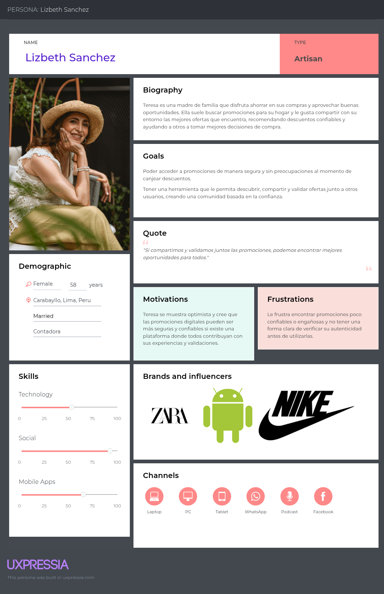

## Segmento Objetivo 2: Empresas afiliadas (B2B)

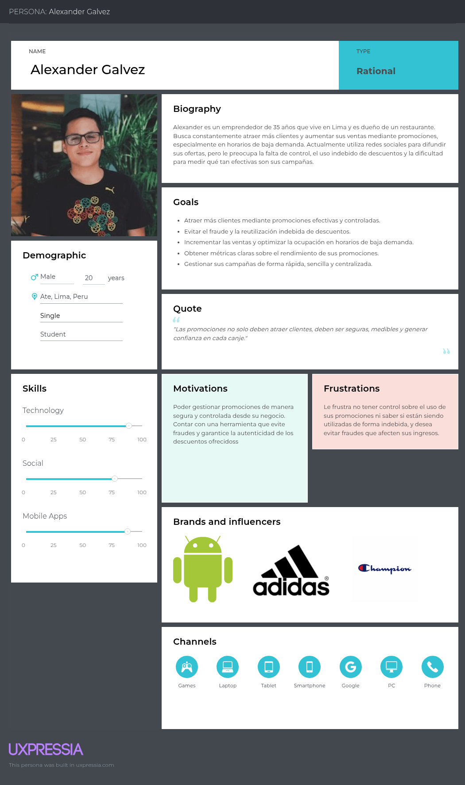

### 2.3.2. User Task Matrix

En esta sección se presenta el **User Task Matrix**, construido a partir de los User Persona que representan a los dos segmentos clave identificados en la plataforma.

**Segmento 1:** Usuarios consumidores (representado por Lizbeth Sánchez).
**Segmento 2:** Negocios afiliados (representado por Alexander Gálvez).

Las tareas fueron identificadas a partir del análisis del comportamiento esperado de ambos perfiles dentro de la aplicación, considerando sus necesidades, objetivos y puntos de interacción con la plataforma. Cada tarea fue evaluada según su frecuencia de uso y nivel de importancia, con el fin de priorizar funcionalidades clave para el desarrollo del MVP y mejorar la experiencia general del sistema.

<table border="1" cellpadding="8" cellspacing="0">
  <thead>
    <tr>
      <th rowspan="2">Tarea / Task</th>
      <th colspan="2">Lizbeth Sánchez</th>
      <th colspan="2">Alexander Gálvez</th>
    </tr>
    <tr>
      <th>Frecuencia</th>
      <th>Importancia</th>
      <th>Frecuencia</th>
      <th>Importancia</th>
    </tr>
  </thead>
  <tbody>
    <tr>
      <td>Explorar promociones disponibles</td>
      <td>Alta</td>
      <td>Alta</td>
      <td>Media</td>
      <td>Media</td>
    </tr>
    <tr>
      <td>Buscar promociones por categoría/ubicación</td>
      <td>Alta</td>
      <td>Alta</td>
      <td>Baja</td>
      <td>Media</td>
    </tr>
    <tr>
      <td>Revisar detalles de promociones</td>
      <td>Alta</td>
      <td>Alta</td>
      <td>Alta</td>
      <td>Alta</td>
    </tr>
    <tr>
      <td>Ver reseñas y calificaciones</td>
      <td>Alta</td>
      <td>Alta</td>
      <td>Media</td>
      <td>Alta</td>
    </tr>
    <tr>
      <td>Generar código QR para canje</td>
      <td>Media</td>
      <td>Alta</td>
      <td>Alta</td>
      <td>Alta</td>
    </tr>
    <tr>
      <td>Canjear promociones en punto de venta</td>
      <td>Media</td>
      <td>Alta</td>
      <td>Alta</td>
      <td>Alta</td>
    </tr>
    <tr>
      <td>Calificar y dejar reseñas</td>
      <td>Media</td>
      <td>Media</td>
      <td>Media</td>
      <td>Alta</td>
    </tr>
    <tr>
      <td>Consultar historial de promociones</td>
      <td>Baja</td>
      <td>Media</td>
      <td>Media</td>
      <td>Alta</td>
    </tr>
    <tr>
      <td>Crear y publicar promociones</td>
      <td>-</td>
      <td>-</td>
      <td>Alta</td>
      <td>Alta</td>
    </tr>
    <tr>
      <td>Monitorear rendimiento de promociones</td>
      <td>-</td>
      <td>-</td>
      <td>Alta</td>
      <td>Alta</td>
    </tr>
    <tr>
      <td>Validar códigos QR de clientes</td>
      <td>-</td>
      <td>-</td>
      <td>Alta</td>
      <td>Alta</td>
    </tr>
    <tr>
      <td>Gestionar promociones activas/inactivas</td>
      <td>-</td>
      <td>-</td>
      <td>Media</td>
      <td>Alta</td>
    </tr>
  </tbody>
</table>

### 2.3.3. User Journey Mapping

En esta sección se presentan los User Journey Maps de los dos segmentos objetivo: 

 

**Segmento Objetivo 1: Usuario consumidor (B2C)**

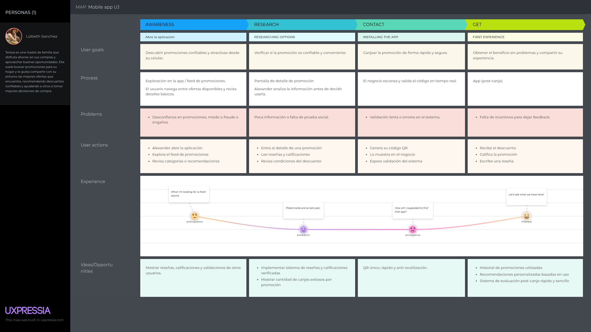

**Segmento Objetivo 2: Empresas afiliadas (B2B)**

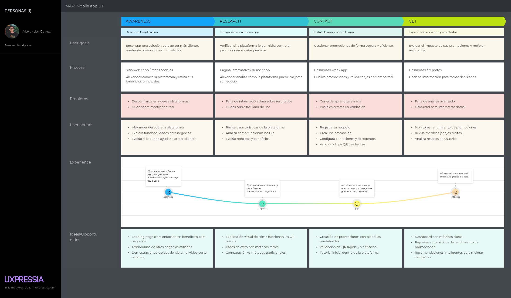

### 2.3.4. Empathy Mapping

En esta sección se presentan los Empathy Maps. Estos nos ayudarán a comprender las experiencias, emociones y pensamientos que expresan los usuarios de cada segmento objetivo.

**Segmento Objetivo 1: Usuario consumidor (B2C)**

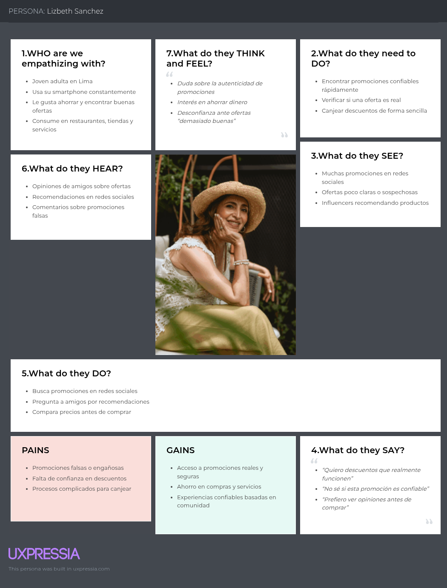

**Segmento Objetivo 2: Empresas afiliadas (B2B)**

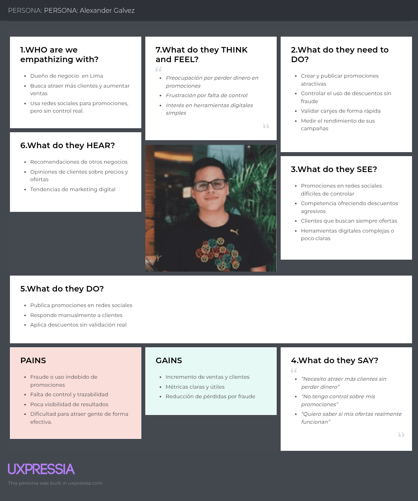

### 2.3.5. Big Picture EventStorming

En esta sección se presenta el trabajo realizado durante la sesión de Big Picture Event Storming, enfocada en comprender el dominio general del negocio de promociones digitales. Para ello se utilizaron post-its en Miro para mapear los eventos significativos que ocurren en el flujo operativo actual, desde la creación y publicación de promociones hasta su redención mediante códigos QR y la posterior evaluación por parte de los usuarios.

Este proceso permitió identificar los eventos clave, los actores involucrados, las interacciones dentro del sistema y las principales oportunidades de mejora, lo cual resulta fundamental para el diseño y desarrollo de la solución propuesta.

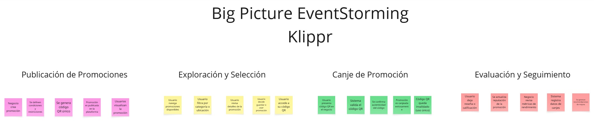

### 2.3.6. Ubiquitous Language

**User Profile (Perfil de Usuario):** Perfil del usuario dentro de la plataforma, donde se almacena su actividad, historial y preferencias.

**Smart Dashboard (Panel Inteligente):** Interfaz principal donde los negocios monitorean el rendimiento de sus promociones y los usuarios visualizan ofertas relevantes.

**Performance Report (Reporte de Rendimiento):** Informe con métricas como número de visualizaciones, canjes, conversiones y efectividad de promociones.

**Campaign Schedule (Agenda de Campañas):** Calendario para programar la duración, activación y expiración de promociones.

**Fraud Alert (Alerta de Fraude):** Notificación automática cuando se detecta un intento de uso indebido o duplicado de un código QR.

**Promotion Catalog (Catálogo de Promociones):** Lista de promociones disponibles organizadas por categoría, ubicación o popularidad.

**Merchant (Negocio):** Empresa o establecimiento que publica promociones y descuentos dentro de la plataforma.

**Review System (Sistema de Reseñas):** Espacio donde los usuarios califican y comentan sobre promociones y experiencias.

**Redemption History (Historial de Canjes):** Registro de todas las promociones utilizadas por un usuario.

**QR Code (Código QR):** Código único, dinámico e irrepetible utilizado para canjear promociones.

**Redemption Validation (Validación de Canje):** Proceso de verificación del código QR para asegurar que sea válido y no reutilizado.

**Campaign Management (Gestión de Campañas):** Proceso mediante el cual los negocios crean, editan y administran sus promociones.

**Automatic Report Generation (Generación Automática de Reportes):** Función que genera informes de rendimiento de campañas sin intervención manual.

**Real-Time Analytics (Analítica en Tiempo Real):** Seguimiento en vivo del desempeño de promociones y comportamiento de usuarios.

**User Recommendation (Recomendación de Usuario):** Sugerencias de promociones basadas en preferencias, historial y ubicación.

**Promotion (Promoción):** Oferta o descuento publicado por un negocio.

**Redemption (Canje):** Acción de utilizar una promoción mediante un código QR.

**Unique Code System (Sistema de Código Único):** Mecanismo que garantiza que cada promoción tenga un código QR no reutilizable.

**Engagement (Interacción):** Nivel de participación del usuario (visualizaciones, canjes, reseñas).

**Notification (Notificación):** Mensajes enviados para informar sobre nuevas promociones, canjes o actividad relevante.

## 2.4. Requirements specification

### 2.4.1. User Stories 

<table border="1">
<tr><td>Story ID</td><td>US01</td><td>User</td><td>Visitante</td><td>Priority</td><td>Alta</td><td>Epic</td><td>EP01</td></tr>
<tr><td>Title</td><td colspan="5">Ver información general del sistema</td></tr>
<tr><td>Description</td><td colspan="5">Como visitante, quiere conocer el propósito del sistema para entender su valor.</td></tr>
<tr><td>Acceptance Criteria</td><td colspan="5">
Dado que el visitante accede al sitio, 
Cuando consulta la información disponible, 
Entonces comprende el propósito del sistema.
</td></tr>
</table>
 

<table border="1" width="100%"><tr>
<td>Story ID</td><td>US02</td><td>User</td><td>Visitante</td><td>Priority</td><td>Media</td><td>Epic</td><td>EP01</td></tr>
<tr><td>Title</td><td colspan="5">Conocer al equipo</td></tr>
<tr><td>Description</td><td colspan="5">Como visitante, quiere conocer al equipo responsable para generar confianza.</td></tr>
<tr><td>Acceptance Criteria</td><td colspan="5">
Dado que el visitante consulta información institucional, 
Cuando revisa el contenido, 
Entonces identifica al equipo y su propósito.
</td></tr>
</table>
 

<table border="1" width="100%"><tr>
<tr><td>Story ID</td><td>US03</td><td>User</td><td>Visitante</td><td>Priority</td><td>Media</td><td>Epic</td><td>EP01</td></tr>
<tr><td>Title</td><td colspan="5">Entender funcionamiento del sistema</td></tr>
<tr><td>Description</td><td colspan="5">Como visitante, quiere entender el flujo del sistema para evaluar su utilidad.</td></tr>
<tr><td>Acceptance Criteria</td><td colspan="5">
Dado que el visitante accede a la explicación del sistema, 
Cuando revisa la información, 
Entonces comprende el flujo operativo.
</td></tr>
</table>
 

<table border="1" width="100%"><tr>
<tr><td>Story ID</td><td>US04</td><td>User</td><td>Visitante</td><td>Priority</td><td>Media</td><td>Epic</td><td>EP01</td></tr>
<tr><td>Title</td><td colspan="5">Consultar preguntas frecuentes</td></tr>
<tr><td>Description</td><td colspan="5">Como visitante, quiere resolver dudas comunes rápidamente.</td></tr>
<tr><td>Acceptance Criteria</td><td colspan="5">
Dado que el visitante accede a preguntas frecuentes, 
Cuando revisa la información, 
Entonces encuentra respuestas relevantes.
</td></tr>
</table>
 

<table border="1" width="100%"><tr>
<tr><td>Story ID</td><td>US05</td><td>User</td><td>Visitante</td><td>Priority</td><td>Baja</td><td>Epic</td><td>EP01</td></tr>
<tr><td>Title</td><td colspan="5">Visualizar beneficios</td></tr>
<tr><td>Description</td><td colspan="5">Como visitante, quiere conocer beneficios para evaluar la adopción.</td></tr>
<tr><td>Acceptance Criteria</td><td colspan="5">
Dado que el visitante revisa beneficios, 
Cuando analiza la información, 
Entonces identifica ventajas del sistema.
</td></tr>
</table>
 

<table border="1" width="100%"><tr>
<tr><td>Story ID</td><td>US06</td><td>User</td><td>Visitante</td><td>Priority</td><td>Baja</td><td>Epic</td><td>EP01</td></tr>
<tr><td>Title</td><td colspan="5">Consultar planes</td></tr>
<tr><td>Description</td><td colspan="5">Como visitante, quiere conocer planes disponibles para evaluar opciones.</td></tr>
<tr><td>Acceptance Criteria</td><td colspan="5">
Dado que el visitante consulta planes, 
Cuando revisa opciones, 
Entonces comprende diferencias entre planes.
</td></tr>
</table>
 

<table border="1" width="100%"><tr>
<tr><td>Story ID</td><td>US07</td><td>User</td><td>Solicitante</td><td>Priority</td><td>Alta</td><td>Epic</td><td>EP02</td></tr>
<tr><td>Title</td><td colspan="5">Registrar pedido</td></tr>
<tr><td>Description</td><td colspan="5">Como solicitante, quiere registrar pedidos para solicitar combustible.</td></tr>
<tr><td>Acceptance Criteria</td><td colspan="5">
Dado datos válidos, 
Cuando registra pedido, 
Entonces se almacena correctamente.
</td></tr>
</table>
 

<table border="1" width="100%"><tr>
<tr><td>Story ID</td><td>US08</td><td>User</td><td>Solicitante</td><td>Priority</td><td>Alta</td><td>Epic</td><td>EP02</td></tr>
<tr><td>Title</td><td colspan="5">Consultar estado</td></tr>
<tr><td>Description</td><td colspan="5">Como solicitante, quiere consultar estado para seguimiento.</td></tr>
<tr><td>Acceptance Criteria</td><td colspan="5">
Dado pedidos existentes, 
Cuando consulta estado, 
Entonces visualiza estado actualizado.
</td></tr>
</table>
 

<table border="1" width="100%"><tr>
<tr><td>Story ID</td><td>US09</td><td>User</td><td>Solicitante</td><td>Priority</td><td>Alta</td><td>Epic</td><td>EP02</td></tr>
<tr><td>Title</td><td colspan="5">Confirmar recepción</td></tr>
<tr><td>Description</td><td colspan="5">Como solicitante, quiere confirmar entrega para cerrar proceso.</td></tr>
<tr><td>Acceptance Criteria</td><td colspan="5">
Dado pedido entregado, 
Cuando confirma recepción, 
Entonces cambia a finalizado.
</td></tr>
</table>
 

<table border="1" width="100%"><tr>
<tr><td>Story ID</td><td>US10</td><td>User</td><td>Solicitante</td><td>Priority</td><td>Media</td><td>Epic</td><td>EP02</td></tr>
<tr><td>Title</td><td colspan="5">Ver historial</td></tr>
<tr><td>Description</td><td colspan="5">Como solicitante, quiere revisar pedidos anteriores.</td></tr>
<tr><td>Acceptance Criteria</td><td colspan="5">
Dado historial disponible, 
Cuando consulta, 
Entonces obtiene registros.
</td></tr>
</table>
 

<table border="1" width="100%"><tr>
<tr><td>Story ID</td><td>US11</td><td>User</td><td>Proveedor</td><td>Priority</td><td>Alta</td><td>Epic</td><td>EP03</td></tr>
<tr><td>Title</td><td colspan="5">Aprobar pedido</td></tr>
<tr><td>Description</td><td colspan="5">Como proveedor, quiere aprobar pedidos válidos.</td></tr>
<tr><td>Acceptance Criteria</td><td colspan="5">
Dado pago validado, 
Cuando aprueba pedido, 
Entonces cambia estado.
</td></tr>
</table>
 

<table border="1" width="100%"><tr>
<tr><td>Story ID</td><td>US12</td><td>User</td><td>Proveedor</td><td>Priority</td><td>Alta</td><td>Epic</td><td>EP03</td></tr>
<tr><td>Title</td><td colspan="5">Despachar pedido</td></tr>
<tr><td>Description</td><td colspan="5">Como proveedor, quiere despachar pedidos aprobados.</td></tr>
<tr><td>Acceptance Criteria</td><td colspan="5">
Dado pedido aprobado, 
Cuando despacha, 
Entonces cambia estado.
</td></tr>
</table>
 

<table border="1" width="100%"><tr>
<tr><td>Story ID</td><td>US13</td><td>User</td><td>Proveedor</td><td>Priority</td><td>Alta</td><td>Epic</td><td>EP03</td></tr>
<tr><td>Title</td><td colspan="5">Cerrar pedido</td></tr>
<tr><td>Description</td><td colspan="5">Como proveedor, quiere cerrar pedidos finalizados.</td></tr>
<tr><td>Acceptance Criteria</td><td colspan="5">
Dado confirmación del cliente, 
Cuando cierra pedido, 
Entonces queda finalizado.
</td></tr>
</table>
 

<table border="1" width="100%"><tr>
<tr><td>Story ID</td><td>US14</td><td>User</td><td>Usuario</td><td>Priority</td><td>Alta</td><td>Epic</td><td>EP04</td></tr>
<tr><td>Title</td><td colspan="5">Iniciar sesión</td></tr>
<tr><td>Description</td><td colspan="5">Como usuario, quiere autenticarse.</td></tr>
<tr><td>Acceptance Criteria</td><td colspan="5">
Dado credenciales válidas, 
Cuando inicia sesión, 
Entonces accede al sistema.
</td></tr>
</table>
 

<table border="1" width="100%"><tr>
<tr><td>Story ID</td><td>US15</td><td>User</td><td>Usuario</td><td>Priority</td><td>Alta</td><td>Epic</td><td>EP04</td></tr>
<tr><td>Title</td><td colspan="5">Recuperar contraseña</td></tr>
<tr><td>Description</td><td colspan="5">Como usuario, quiere recuperar acceso.</td></tr>
<tr><td>Acceptance Criteria</td><td colspan="5">
Dado correo válido, 
Cuando solicita recuperación, 
Entonces recibe enlace.
</td></tr>
</table>
 

<table border="1" width="100%"><tr>
<tr><td>Story ID</td><td>US16</td><td>User</td><td>Usuario</td><td>Priority</td><td>Media</td><td>Epic</td><td>EP04</td></tr>
<tr><td>Title</td><td colspan="5">Cerrar sesión</td></tr>
<tr><td>Description</td><td colspan="5">Como usuario, quiere cerrar sesión.</td></tr>
<tr><td>Acceptance Criteria</td><td colspan="5">
Dado sesión activa, 
Cuando cierra sesión, 
Entonces se invalida.
</td></tr>
</table>
 

<table border="1" width="100%"><tr>
<tr><td>Story ID</td><td>US17</td><td>User</td><td>Developer</td><td>Priority</td><td>Alta</td><td>Epic</td><td>EP06</td></tr>
<tr><td>Title</td><td colspan="5">API Login</td></tr>
<tr><td>Description</td><td colspan="5">Como developer, quiere endpoint de autenticación.</td></tr>
<tr><td>Acceptance Criteria</td><td colspan="5">
Dado request válido, 
Cuando procesa, 
Entonces retorna token.
</td></tr>
</table>
 

<table border="1" width="100%"><tr>
<tr><td>Story ID</td><td>US18</td><td>User</td><td>Developer</td><td>Priority</td><td>Alta</td><td>Epic</td><td>EP06</td></tr>
<tr><td>Title</td><td colspan="5">API Logout</td></tr>
<tr><td>Description</td><td colspan="5">Como developer, quiere invalidar sesión.</td></tr>
<tr><td>Acceptance Criteria</td><td colspan="5">
Dado token válido, 
Cuando procesa, 
Entonces invalida sesión.
</td></tr>
</table>
 

<table border="1" width="100%"><tr>
<tr><td>Story ID</td><td>US19</td><td>User</td><td>Developer</td><td>Priority</td><td>Alta</td><td>Epic</td><td>EP07</td></tr>
<tr><td>Title</td><td colspan="5">API Crear pedido</td></tr>
<tr><td>Description</td><td colspan="5">Como developer, quiere registrar pedidos.</td></tr>
<tr><td>Acceptance Criteria</td><td colspan="5">
Dado datos válidos, 
Cuando procesa, 
Entonces crea registro.
</td></tr>
</table>
 

<table border="1" width="100%"><tr>
<tr><td>Story ID</td><td>US20</td><td>User</td><td>Developer</td><td>Priority</td><td>Media</td><td>Epic</td><td>EP07</td></tr>
<tr><td>Title</td><td colspan="5">API Consultar pedidos</td></tr>
<tr><td>Description</td><td colspan="5">Como developer, quiere listar pedidos.</td></tr>
<tr><td>Acceptance Criteria</td><td colspan="5">
Dado usuario válido, 
Cuando consulta, 
Entonces retorna lista.
</td></tr>
</table>
 

<table border="1" width="100%"><tr>
<tr><td>Story ID</td><td>US21</td><td>User</td><td>Developer</td><td>Priority</td><td>Media</td><td>Epic</td><td>EP07</td></tr>
<tr><td>Title</td><td colspan="5">API Actualizar estado</td></tr>
<tr><td>Description</td><td colspan="5">Como developer, quiere actualizar estado.</td></tr>
<tr><td>Acceptance Criteria</td><td colspan="5">
Dado pedido existente, 
Cuando actualiza, 
Entonces cambia estado.
</td></tr>
</table>
 

<table border="1" width="100%"><tr>
<tr><td>Story ID</td><td>US22</td><td>User</td><td>Developer</td><td>Priority</td><td>Media</td><td>Epic</td><td>EP07</td></tr>
<tr><td>Title</td><td colspan="5">API Reportes</td></tr>
<tr><td>Description</td><td colspan="5">Como developer, quiere generar reportes.</td></tr>
<tr><td>Acceptance Criteria</td><td colspan="5">
Dado parámetros válidos, 
Cuando procesa, 
Entonces retorna resultados.
</td></tr>
</table>
 

<table border="1" width="100%"><tr>
<tr><td>Story ID</td><td>US23</td><td>User</td><td>Equipo</td><td>Priority</td><td>Alta</td><td>Epic</td><td>EP08</td></tr>
<tr><td>Title</td><td colspan="5">Spike integración pagos</td></tr>
<tr><td>Description</td><td colspan="5">Como equipo, quiere investigar integración de pagos.</td></tr>
<tr><td>Acceptance Criteria</td><td colspan="5">
Dado necesidad de pagos, 
Cuando investiga, 
Entonces documenta resultados.
</td></tr>
</table>
 

<table border="1" width="100%"><tr>
<tr><td>Story ID</td><td>US24</td><td>User</td><td>Equipo</td><td>Priority</td><td>Media</td><td>Epic</td><td>EP08</td></tr>
<tr><td>Title</td><td colspan="5">Spike rendimiento</td></tr>
<tr><td>Description</td><td colspan="5">Como equipo, quiere analizar rendimiento del sistema.</td></tr>
<tr><td>Acceptance Criteria</td><td colspan="5">
Dado pruebas realizadas, 
Cuando evalúa resultados, 
Entonces documenta conclusiones.
</td></tr>
</table>
 

<table border="1" width="100%"><tr>
<tr><td>Story ID</td><td>US25</td><td>User</td><td>Equipo</td><td>Priority</td><td>Media</td><td>Epic</td><td>EP08</td></tr>
<tr><td>Title</td><td colspan="5">Spike seguridad</td></tr>
<tr><td>Description</td><td colspan="5">Como equipo, quiere evaluar seguridad.</td></tr>
<tr><td>Acceptance Criteria</td><td colspan="5">
Dado análisis realizado, 
Cuando evalúa riesgos, 
Entonces documenta mitigaciones.
</td></tr>
</table>
 

<table border="1" width="100%"><tr>
<tr><td>Story ID</td><td>US26</td><td>User</td><td>Equipo</td><td>Priority</td><td>Baja</td><td>Epic</td><td>EP08</td></tr>
<tr><td>Title</td><td colspan="5">Spike tecnología frontend</td></tr>
<tr><td>Description</td><td colspan="5">Como equipo, quiere evaluar tecnologías frontend.</td></tr>
<tr><td>Acceptance Criteria</td><td colspan="5">
Dado evaluación técnica, 
Cuando compara opciones, 
Entonces documenta decisión.
</td></tr>
</table>
 

<table border="1" width="100%"><tr>
<tr><td>Story ID</td><td>US27</td><td>User</td><td>Solicitante</td><td>Priority</td><td>Media</td><td>Epic</td><td>EP02</td></tr>
<tr><td>Title</td><td colspan="5">Filtrar pedidos</td></tr>
<tr><td>Description</td><td colspan="5">Como solicitante, quiere filtrar pedidos.</td></tr>
<tr><td>Acceptance Criteria</td><td colspan="5">
Dado criterios, 
Cuando filtra, 
Entonces obtiene resultados.
</td></tr>
</table>
 

<table border="1" width="100%"><tr>
<tr><td>Story ID</td><td>US28</td><td>User</td><td>Proveedor</td><td>Priority</td><td>Media</td><td>Epic</td><td>EP03</td></tr>
<tr><td>Title</td><td colspan="5">Ver pedidos pendientes</td></tr>
<tr><td>Description</td><td colspan="5">Como proveedor, quiere ver pedidos pendientes.</td></tr>
<tr><td>Acceptance Criteria</td><td colspan="5">
Dado pedidos existentes, 
Cuando consulta, 
Entonces obtiene lista.
</td></tr>
</table>
 

<table border="1" width="100%"><tr>
<tr><td>Story ID</td><td>US29</td><td>User</td><td>Usuario</td><td>Priority</td><td>Media</td><td>Epic</td><td>EP09</td></tr>
<tr><td>Title</td><td colspan="5">Ver perfil</td></tr>
<tr><td>Description</td><td colspan="5">Como usuario, quiere ver su información.</td></tr>
<tr><td>Acceptance Criteria</td><td colspan="5">
Dado sesión activa, 
Cuando consulta, 
Entonces obtiene datos.
</td></tr>
</table>
 

<table border="1" width="100%"><tr>
<tr><td>Story ID</td><td>US30</td><td>User</td><td>Usuario</td><td>Priority</td><td>Media</td><td>Epic</td><td>EP09</td></tr>
<tr><td>Title</td><td colspan="5">Editar perfil</td></tr>
<tr><td>Description</td><td colspan="5">Como usuario, quiere actualizar datos.</td></tr>
<tr><td>Acceptance Criteria</td><td colspan="5">
Dado datos válidos, 
Cuando actualiza, 
Entonces guarda cambios.
</td></tr>
</table>
 

### 2.4.2. Impact Mapping

El Impact Map de Klippr alinea objetivos de negocio (reducir fraude, construir densidad local verificada) con dos segmentos clave: usuarios consumidores (que requieren confianza mediante QR único y reseñas) y empresas afiliadas (que necesitan analítica clara y anti-fraude robusto). A partir de estos impactos deseados, derivamos entregables de producto (validación QR <2s, dashboard de métricas, sistema de reseñas) y user stories que garantizan alineación entre desarrollo y valor de negocio.

#### Segmento 1: Usuarios
 

    

 

#### Segmento 2: Empresas afiliadas(B2B)

    

### 2.4.3. Product Backlog

El Product Backlog es **la misma lista de User Stories de 2.4.1**, pero **ordenadas por complejidad técnica y prioridad de negocio**. Esta ordenación asegura desarrollo incremental del MVP comenzando con funcionalidades de mayor impacto y complejidad.

 

<table border="1" cellspacing="0" cellpadding="6">
<thead>
<tr>
<th>#Orden</th>
<th>ID</th>
<th>Título</th>
<th>Descripción</th>
<th>Story Points</th>
</tr>
</thead>

<tbody>

<tr><td>01</td><td>US-01</td><td>Explorar descuentos</td><td>Como usuario, quiere visualizar descuentos disponibles para encontrar promociones</td><td>3</td></tr>
<tr><td>02</td><td>US-02</td><td>Filtrar descuentos</td><td>Como usuario, quiere filtrar descuentos por categoría o ubicación</td><td>3</td></tr>
<tr><td>03</td><td>US-03</td><td>Ver detalle de promoción</td><td>Como usuario, quiere ver condiciones de uso</td><td>2</td></tr>
<tr><td>04</td><td>US-21</td><td>Buscar promociones</td><td>Como usuario, quiere buscar promociones por nombre</td><td>3</td></tr>

<tr><td>05</td><td>US-04</td><td>Generar código QR</td><td>Como usuario, quiere generar un código QR único</td><td>5</td></tr>
<tr><td>06</td><td>US-07</td><td>Escanear QR</td><td>Como empresa, quiere validar códigos QR</td><td>5</td></tr>
<tr><td>07</td><td>US-08</td><td>Validación manual</td><td>Como empresa, quiere validar códigos manualmente</td><td>3</td></tr>
<tr><td>08</td><td>US-09</td><td>Bloquear código</td><td>Como empresa, quiere evitar reutilización</td><td>3</td></tr>

<tr><td>09</td><td>US-05</td><td>Ver códigos generados</td><td>Como usuario, quiere visualizar sus códigos</td><td>2</td></tr>
<tr><td>10</td><td>US-06</td><td>Ver historial</td><td>Como usuario, quiere ver historial de descuentos</td><td>3</td></tr>
<tr><td>11</td><td>US-20</td><td>Guardar promociones</td><td>Como usuario, quiere guardar promociones favoritas</td><td>3</td></tr>

<tr><td>12</td><td>US-10</td><td>Crear promoción</td><td>Como empresa, quiere crear promociones</td><td>5</td></tr>
<tr><td>13</td><td>US-22</td><td>Editar promoción</td><td>Como empresa, quiere modificar promociones</td><td>3</td></tr>
<tr><td>14</td><td>US-23</td><td>Desactivar promoción</td><td>Como empresa, quiere desactivar promociones</td><td>2</td></tr>
<tr><td>15</td><td>US-11</td><td>Definir condiciones</td><td>Como empresa, quiere establecer condiciones</td><td>3</td></tr>
<tr><td>16</td><td>US-12</td><td>Limitar canjes</td><td>Como empresa, quiere limitar uso</td><td>3</td></tr>

<tr><td>17</td><td>US-13</td><td>Publicar reseña</td><td>Como usuario, quiere compartir experiencia</td><td>3</td></tr>
<tr><td>18</td><td>US-14</td><td>Calificar promoción</td><td>Como usuario, quiere calificar promociones</td><td>2</td></tr>
<tr><td>19</td><td>US-15</td><td>Comentar</td><td>Como usuario, quiere comentar publicaciones</td><td>2</td></tr>
<tr><td>20</td><td>US-16</td><td>Reaccionar</td><td>Como usuario, quiere reaccionar</td><td>2</td></tr>
<tr><td>21</td><td>US-24</td><td>Compartir promoción</td><td>Como usuario, quiere compartir promociones con otros usuarios</td><td>3</td></tr>

<tr><td>21</td><td>US-17</td><td>Registro</td><td>Como usuario, quiere registrarse</td><td>3</td></tr>
<tr><td>22</td><td>US-18</td><td>Login</td><td>Como usuario, quiere iniciar sesión</td><td>3</td></tr>
<tr><td>23</td><td>US-19</td><td>Recuperar contraseña</td><td>Como usuario, quiere recuperar acceso</td><td>3</td></tr>

<tr><td>24</td><td>TS-01</td><td>API generación QR</td><td>Como developer, quiere generar QR</td><td>5</td></tr>
<tr><td>25</td><td>TS-02</td><td>API validación QR</td><td>Como developer, quiere validar QR</td><td>5</td></tr>
<tr><td>26</td><td>TS-03</td><td>API historial</td><td>Como developer, quiere obtener historial</td><td>3</td></tr>

<tr><td>27</td><td>SP-01</td><td>Investigar QR</td><td>Como developer, quiere evaluar librerías QR</td><td>3</td></tr>
<tr><td>28</td><td>SP-02</td><td>Seguridad QR</td><td>Como developer, quiere analizar seguridad</td><td>3</td></tr>
<tr><td>29</td><td>SP-03</td><td>Escalabilidad</td><td>Como developer, quiere evaluar rendimiento</td><td>5</td></tr>

<tr><td>30</td><td>US-21</td><td>Buscar promociones (refuerzo)</td><td>Como usuario, quiere encontrar promociones fácilmente</td><td>2</td></tr>

</tbody>
</table>

 

**Resumen:**
- **Total de User Stories:** 30 (US01-US30)
- **Total Story Points:** 119
- **MVP Crítico (Órdenes 1-15):** 76 story points — APIs, Flujos de negocio, Autenticación
- **Complejidad Alta (8 SP):** 7 US — APIs, Spikes de infraestructura
- **Complejidad Media (5 SP):** 9 US — Lógica de negocio, consultas, procesos
- **Complejidad Baja (2-3 SP):** 14 US — UI simples, landing page, perfiles
- **Herramienta recomendada:** Jira, Azure DevOps, Trello

---

## 2.5. Strategic-Level Domain-Driven Design

### 2.5.1. EventStorming

Para llevar a cabo los Bounded Context, se deben reconocer los eventos y organizarlos. Asimismo, se utilizan notas adhesivas de colores para representar dichos events/commands/querys.

Para llevar a cabo el proceso de EventStorming empleamos la herramienta **Miro**.

    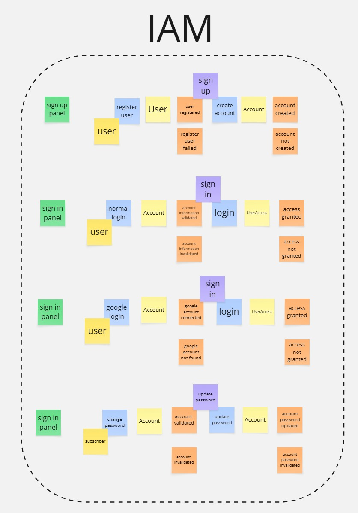
    
    
    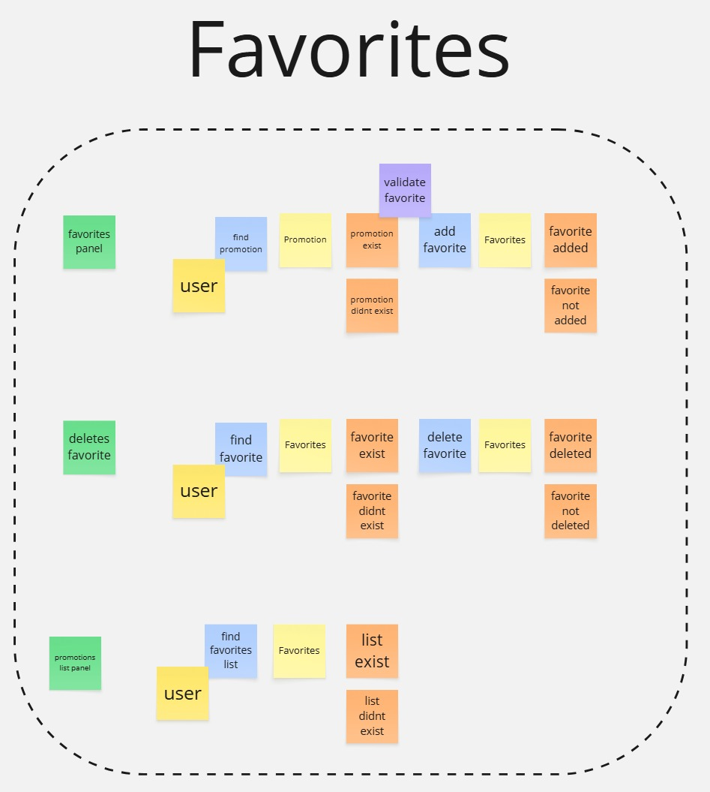
    
    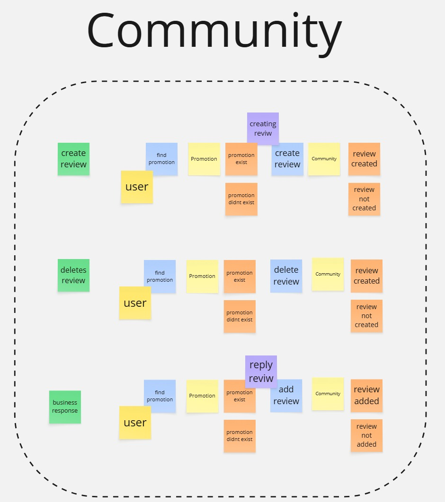
    
    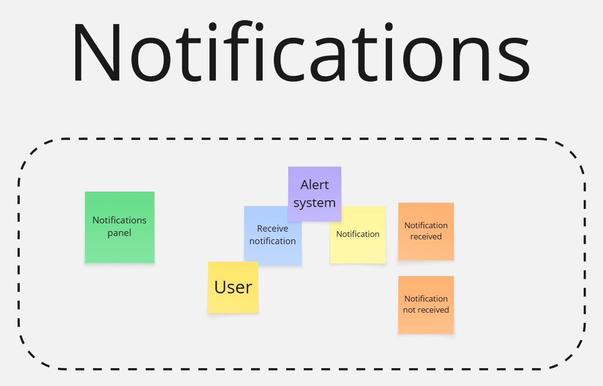
    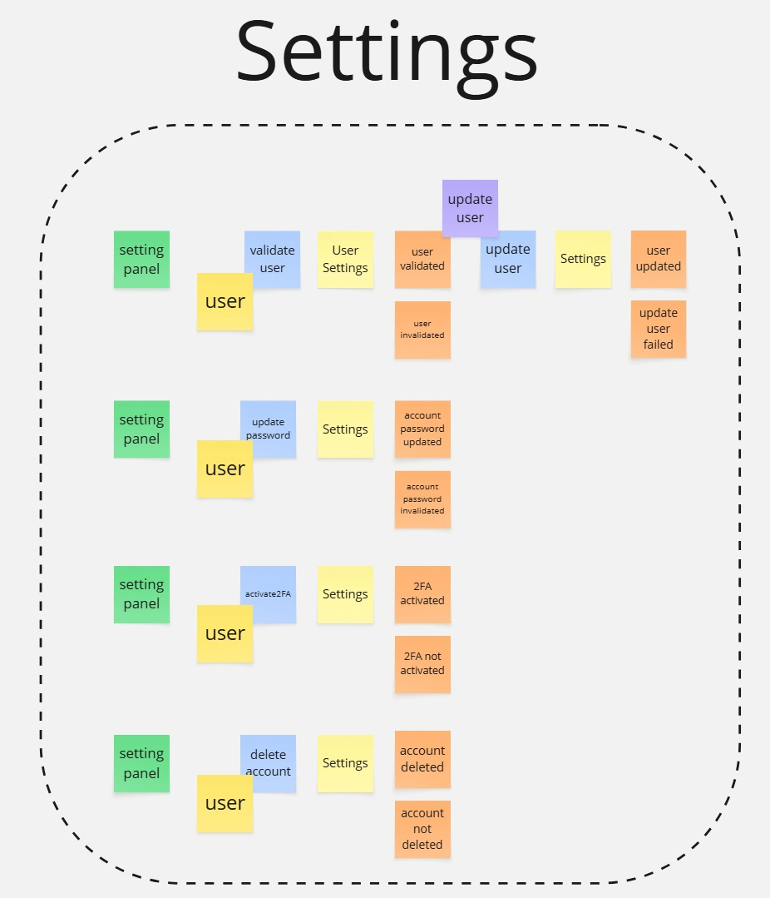

#### 2.5.1.1. Candidate Context Discovery

En esta sección se aplica la técnica de Candidate Context Discovery para identificar y separar los posibles Bounded Contexts del sistema. Se utilizó la técnica look-for-pivotal-events para analizar los eventos que marcan un cambio de estado relevante dentro del modelo de negocio de Klippr. Al identificar eventos como **UsuarioRegistrado**, **PromocionPublicada**, **QRGenerado**, **QRCanjeado** y **ReseñaPublicada**, se detectó que cada uno implicaba responsabilidades y reglas de negocio distintas, lo que llevó a definir los siguientes Bounded Contexts:

| Bounded Context | Descripción | Eventos clave |
|---|---|---|
| **IAM** | Maneja la autenticación y autorización de los tres tipos de usuario: consumidor, negocio afiliado y administrador de plataforma. | `UsuarioRegistrado`, `UsuarioAutenticado`, `NegocioRegistrado` |
| **Profile** | Administra la información de perfil de usuarios consumidores y negocios afiliados, incluyendo el flujo de verificación y aprobación de negocios por el administrador. | `PerfilCreado`, `PerfilActualizado`, `NegocioVerificado`, `NegocioRechazado` |
| **Promotions** | Gestiona el ciclo de vida completo de las campañas de descuento: publicación, edición, pausa y finalización por parte del negocio afiliado. | `PromocionPublicada`, `PromocionPausada`, `PromocionEditada`, `PromocionFinalizada` |
| **Redemption** | Controla la generación del QR único por usuario/oferta, la validación en punto de venta (escaneo o código manual), el bloqueo automático post-canje y la gestión de expiración. | `QRGenerado`, `QRCanjeado`, `QRBloqueado`, `QRExpirado` |
| **Community** | Administra el módulo social: reseñas ligadas a canje completado, calificaciones (1-5), likes, comentarios y respuestas de negocios a reseñas. | `ReseñaPublicada`, `CalificacionRegistrada`, `LikeRegistrado`, `RespuestaPublicada` |
| **Analytics** | Provee métricas por campaña para negocios (vistas, canjes, ratings) y datos de moderación y abuso para el administrador de plataforma. | `MetricaActualizada`, `DashboardConsultado`, `ReporteDeAbusoRegistrado` |

#### 2.5.1.2. Domain Message Flows Modeling

Esta sección utilizará el Domain Message Flow Modelling, una técnica que ilustra cómo fluyen los mensajes de dominio, como comandos, eventos y consultas, entre los distintos contextos delimitados del sistema. Esto permite clarificar las interacciones y responsabilidades de cada contexto.

     
     
     
    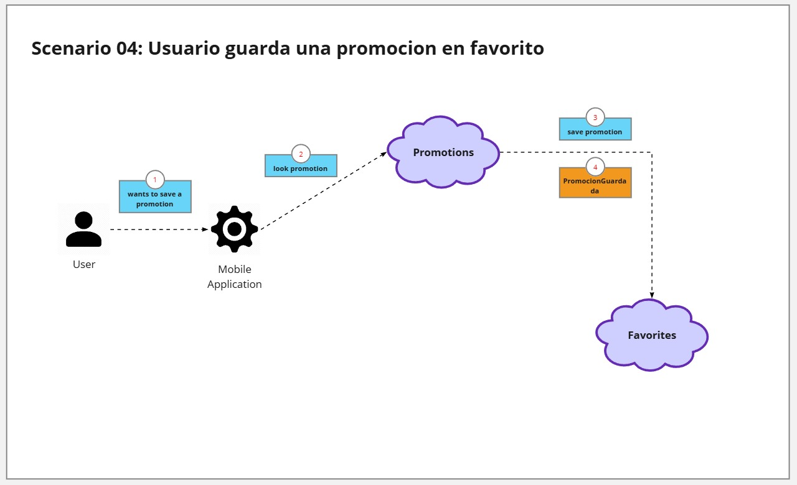 
    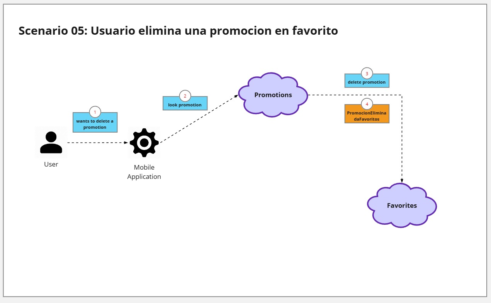 
    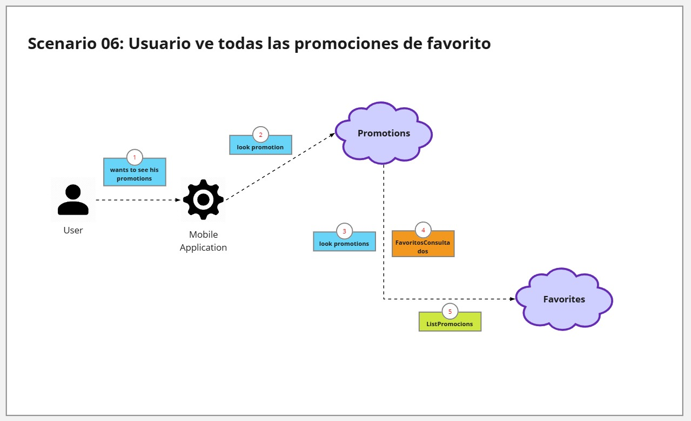 
    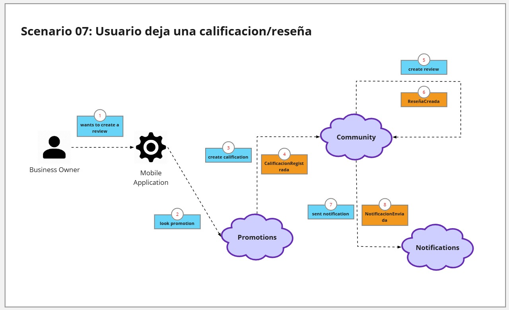 
     
    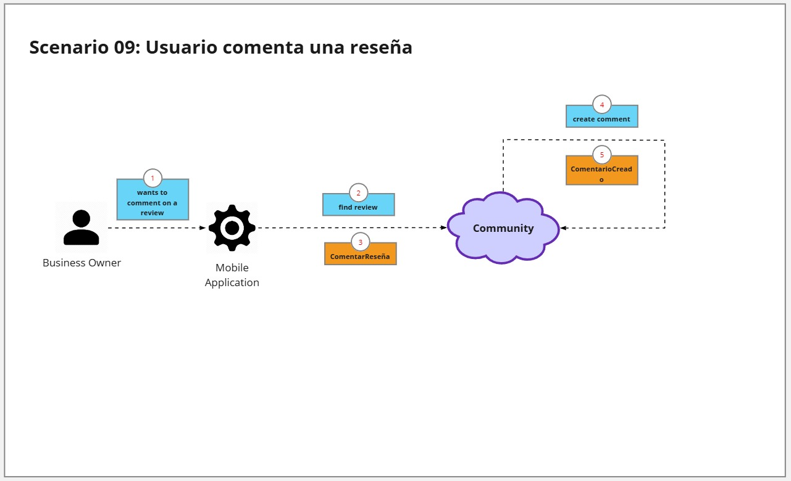 
     

#### 2.5.1.3. Bounded Context Canvases

En esta parte, el Bounded Context Canvas delimitara cada parte del sistema a desarrollar. Permitiendo identificar con claridad qué responsabilidad tiene cada Bounded Context en cómo se relaciona con otros y qué elementos lo conforman, como entidades, agregados y las reglas del negocio.

    
    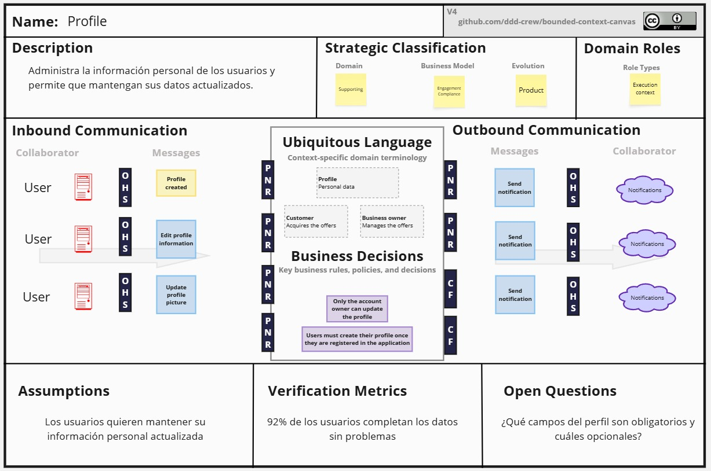 
    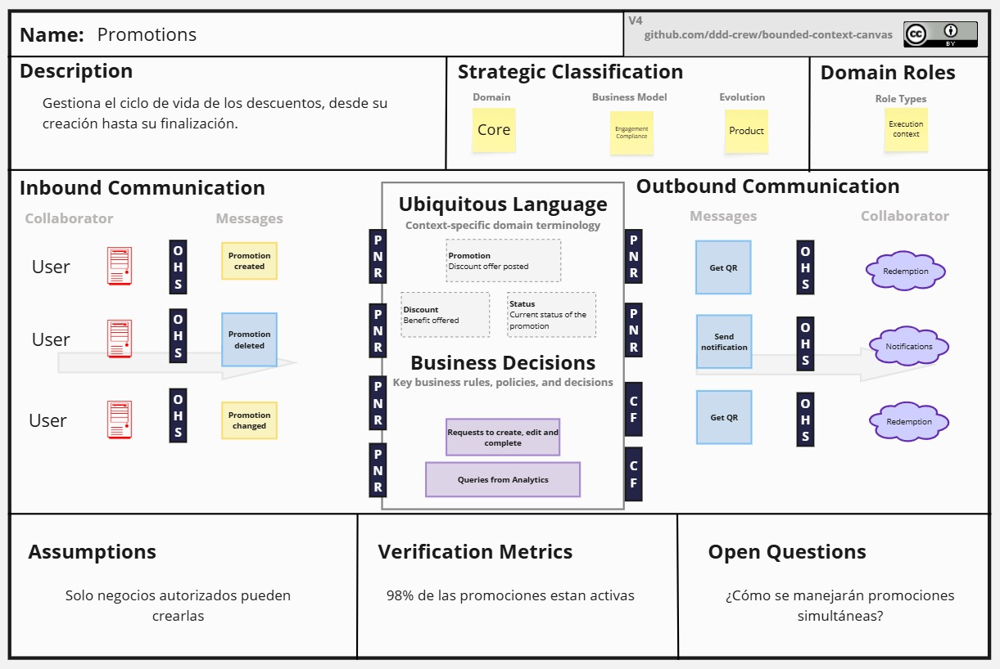 
     
     
     
     
     

### 2.5.2. Context Mapping

    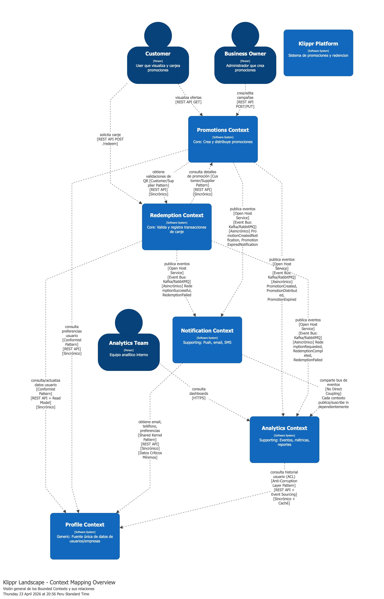

### 2.5.3. Software Architecture

#### 2.5.3.1. Software Architecture Context Level Diagrams

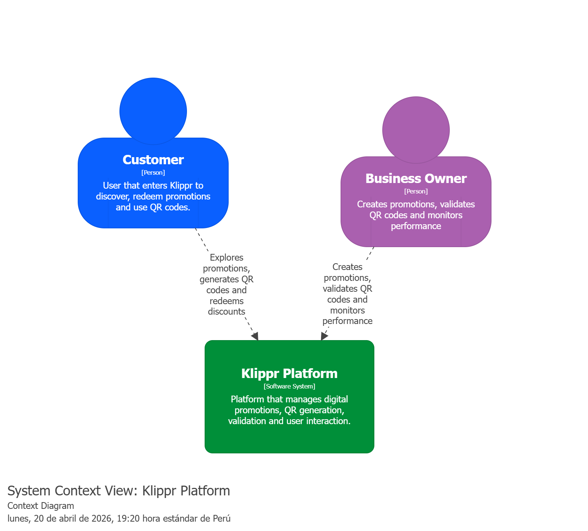

#### 2.5.3.2. Software Architecture Container Level Diagrams

#### 2.5.3.3. Software Architecture Deployment Diagrams

## 2.6. Tactical-Level Domain-Driven Design

### 2.6.1. Bounded Context: IAM

Siguiendo el modelo de arquitectura Clean Architecture, el Bounded Context IAM de Klippr gestiona la autenticación y autorización de los tres tipos de cuenta de la plataforma: usuario consumidor, negocio afiliado y administrador. A continuación se detallan las capas del Bounded Context.

#### 2.6.1.1. Domain Layer

**Sub-capa Model - Aggregates:**

<table border="1" cellpadding="8" cellspacing="0" style="width:100%; border-collapse: collapse;">
  <tr style="background-color:#2c3e50; color:white;">
    <th>Tipo</th>
    <th>Nombre</th>
    <th>Descripción</th>
    <th>Responsabilidad Principal</th>
    <th>Relación con otros elementos</th>
  </tr>
  <tr>
    <td>Aggregate</td>
    <td>User</td>
    <td>Clase que representa a cualquier cuenta registrada en Klippr, independientemente de su rol.</td>
    <td>Ser el punto de entrada para crear y mantener la integridad de la entidad de identidad, incluyendo validación de credenciales y asignación de rol.</td>
    <td>Relacionado con los bounded contexts Profile, Promotions y Community, que requieren la identidad del usuario para operar.</td>
  </tr>
</table>

**Sub-capa Model - Commands:**

<table border="1" cellpadding="8" cellspacing="0" style="width:100%; border-collapse: collapse;">
  <tr style="background-color:#2c3e50; color:white;">
    <th>Tipo</th>
    <th>Nombre</th>
    <th>Descripción</th>
    <th>Responsabilidad Principal</th>
    <th>Relación con otros elementos</th>
  </tr>
  <tr>
    <td>Command</td>
    <td>SignInCommand</td>
    <td>Comando para el inicio de sesión de cualquier tipo de cuenta.</td>
    <td>Representar la intención de autenticar a un usuario y retornar un token de acceso válido.</td>
    <td>Usado en la implementación del servicio de autenticación.</td>
  </tr>
  <tr>
    <td>Command</td>
    <td>SignUpConsumerCommand</td>
    <td>Comando para el registro de un usuario consumidor.</td>
    <td>Representar la intención de crear una cuenta de tipo consumidor con los datos mínimos requeridos.</td>
    <td>Usado en la implementación del servicio de autenticación.</td>
  </tr>
  <tr>
    <td>Command</td>
    <td>SignUpBusinessCommand</td>
    <td>Comando para el registro de un negocio afiliado.</td>
    <td>Representar la intención de crear una cuenta de tipo negocio, sujeta a aprobación por el administrador.</td>
    <td>Usado en el servicio de autenticación y desencadena evento hacia el bounded context Profile para iniciar el flujo de verificación.</td>
  </tr>
</table>

**Sub-capa Model - Queries:**

<table border="1" cellpadding="8" cellspacing="0" style="width:100%; border-collapse: collapse;">
  <tr style="background-color:#2c3e50; color:white;">
    <th>Tipo</th>
    <th>Nombre</th>
    <th>Descripción</th>
    <th>Responsabilidad Principal</th>
    <th>Relación con otros elementos</th>
  </tr>
  <tr>
    <td>Query</td>
    <td>GetAllUsersQuery</td>
    <td>Consulta para obtener todos los usuarios registrados.</td>
    <td>Representar la intención de obtener la lista completa de cuentas, usada por el administrador de plataforma.</td>
    <td>Usado en la implementación del servicio de consultas.</td>
  </tr>
  <tr>
    <td>Query</td>
    <td>GetUserByEmailQuery</td>
    <td>Consulta para obtener un usuario por dirección de email.</td>
    <td>Representar la intención de buscar una cuenta específica por su email, utilizada en el flujo de autenticación.</td>
    <td>Usado en la implementación del servicio de consultas.</td>
  </tr>
  <tr>
    <td>Query</td>
    <td>GetUserByIdQuery</td>
    <td>Consulta para obtener un usuario por su identificador único.</td>
    <td>Representar la intención de recuperar una cuenta por su ID, usada inter-contexto para validar identidad.</td>
    <td>Usado en la implementación del servicio de consultas.</td>
  </tr>
  <tr>
    <td>Query</td>
    <td>GetUsersByRoleQuery</td>
    <td>Consulta para obtener usuarios filtrados por rol.</td>
    <td>Representar la intención de listar cuentas de un tipo específico (CONSUMER, BUSINESS, ADMIN).</td>
    <td>Usado en el panel de administración para gestión de cuentas.</td>
  </tr>
</table>

**Sub-capa Model - Value Objects:**

<table border="1" cellpadding="8" cellspacing="0" style="width:100%; border-collapse: collapse;">
  <tr style="background-color:#2c3e50; color:white;">
    <th>Tipo</th>
    <th>Nombre</th>
    <th>Descripción</th>
    <th>Responsabilidad Principal</th>
    <th>Relación con otros elementos</th>
  </tr>
  <tr>
    <td>Value Object</td>
    <td>Role</td>
    <td>Rol de la cuenta dentro de la plataforma.</td>
    <td>Representar los tres roles posibles: CONSUMER, BUSINESS y ADMIN, determinando las pantallas y funciones accesibles.</td>
    <td>Usado en el Aggregate User y evaluado en el middleware de autorización.</td>
  </tr>
  <tr>
    <td>Value Object</td>
    <td>Email</td>
    <td>Dirección de correo electrónico de la cuenta.</td>
    <td>Encapsular la validación de formato y unicidad del email como identificador de acceso.</td>
    <td>Usado en el Aggregate User y en los comandos de registro.</td>
  </tr>
</table>

**Sub-capa Services:**

<table border="1" cellpadding="8" cellspacing="0" style="width:100%; border-collapse: collapse;">
  <tr style="background-color:#2c3e50; color:white;">
    <th>Tipo</th>
    <th>Nombre</th>
    <th>Descripción</th>
    <th>Responsabilidad Principal</th>
    <th>Relación con otros elementos</th>
  </tr>
  <tr>
    <td>Interface</td>
    <td>IUserCommandService</td>
    <td>Interfaz del servicio de comandos de autenticación.</td>
    <td>Estipular los contratos para operaciones de registro e inicio de sesión.</td>
    <td>Implementado en la capa Application; consumido desde la capa Interface.</td>
  </tr>
  <tr>
    <td>Interface</td>
    <td>IUserQueryService</td>
    <td>Interfaz del servicio de consultas de usuarios.</td>
    <td>Estipular los contratos para operaciones de búsqueda y listado de cuentas.</td>
    <td>Implementado en la capa Infrastructure; consumido desde la capa Interface.</td>
  </tr>
</table>

**Sub-capa Repositories:**

<table border="1" cellpadding="8" cellspacing="0" style="width:100%; border-collapse: collapse;">
  <tr style="background-color:#2c3e50; color:white;">
    <th>Tipo</th>
    <th>Nombre</th>
    <th>Descripción</th>
    <th>Responsabilidad Principal</th>
    <th>Relación con otros elementos</th>
  </tr>
  <tr>
    <td>Interface</td>
    <td>IUserRepository</td>
    <td>Repositorio para operaciones de persistencia del modelo User.</td>
    <td>Definir contratos para operaciones CRUD de cuentas de usuario.</td>
    <td>Implementado en la capa Infrastructure.</td>
  </tr>
</table>

---

#### 2.6.1.2. Interface Layer

**Sub-capa REST - Resources:**

<table border="1" cellpadding="8" cellspacing="0" style="width:100%; border-collapse: collapse;">
  <tr style="background-color:#2c3e50; color:white;">
    <th>Tipo</th>
    <th>Nombre</th>
    <th>Descripción</th>
    <th>Responsabilidad Principal</th>
    <th>Relación con otros elementos</th>
  </tr>
  <tr>
    <td>Resource</td>
    <td>AuthenticatedUserResource</td>
    <td>Estructura de respuesta para usuario autenticado.</td>
    <td>Representar los datos de la cuenta autenticada (id, email, rol, token) de forma estructurada para el cliente móvil.</td>
    <td>Usado en AuthenticationController para respuestas de autenticación exitosa.</td>
  </tr>
  <tr>
    <td>Resource</td>
    <td>SignInResource</td>
    <td>Estructura de una petición para iniciar sesión.</td>
    <td>Representar y exponer los campos requeridos para autenticación (email, contraseña) de forma predeterminada.</td>
    <td>Usado en AuthenticationController para recibir peticiones de login.</td>
  </tr>
  <tr>
    <td>Resource</td>
    <td>SignUpConsumerResource</td>
    <td>Estructura de una petición para registrar un usuario consumidor.</td>
    <td>Representar los campos requeridos para crear una cuenta de tipo consumidor.</td>
    <td>Usado en AuthenticationController para el flujo de registro B2C.</td>
  </tr>
  <tr>
    <td>Resource</td>
    <td>SignUpBusinessResource</td>
    <td>Estructura de una petición para registrar un negocio afiliado.</td>
    <td>Representar los campos requeridos para crear una cuenta de tipo negocio (incluye nombre comercial, categoría y RUC/identificador fiscal).</td>
    <td>Usado en AuthenticationController para el flujo de registro B2B, que inicia el proceso de verificación.</td>
  </tr>
  <tr>
    <td>Resource</td>
    <td>UserResource</td>
    <td>Estructura de datos de una cuenta de usuario.</td>
    <td>Representar y exponer los datos de perfil de identidad de forma estructurada para operaciones de consulta.</td>
    <td>Usado en UsersController para emitir datos de cuentas.</td>
  </tr>
</table>

**Sub-capa REST - Transform:**

<table border="1" cellpadding="8" cellspacing="0" style="width:100%; border-collapse: collapse;">
  <tr style="background-color:#2c3e50; color:white;">
    <th>Tipo</th>
    <th>Nombre</th>
    <th>Descripción</th>
    <th>Responsabilidad Principal</th>
    <th>Relación con otros elementos</th>
  </tr>
  <tr>
    <td>Assembler</td>
    <td>AuthenticatedUserResourceFromEntityAssembler</td>
    <td>Transforma la entidad User a AuthenticatedUserResource.</td>
    <td>Convertir la entidad del dominio a su representación REST incluyendo el token JWT y el rol para que el cliente móvil determine la navegación inicial.</td>
    <td>Usado en AuthenticationController para transformar respuestas de login.</td>
  </tr>
  <tr>
    <td>Assembler</td>
    <td>SignInCommandFromResourceAssembler</td>
    <td>Transforma SignInResource a SignInCommand.</td>
    <td>Convertir la petición REST al comando del dominio correspondiente.</td>
    <td>Usado en AuthenticationController para procesar peticiones de inicio de sesión.</td>
  </tr>
  <tr>
    <td>Assembler</td>
    <td>SignUpConsumerCommandFromResourceAssembler</td>
    <td>Transforma SignUpConsumerResource a SignUpConsumerCommand.</td>
    <td>Convertir la petición REST al comando de registro de consumidor.</td>
    <td>Usado en AuthenticationController para el flujo de registro B2C.</td>
  </tr>
  <tr>
    <td>Assembler</td>
    <td>SignUpBusinessCommandFromResourceAssembler</td>
    <td>Transforma SignUpBusinessResource a SignUpBusinessCommand.</td>
    <td>Convertir la petición REST al comando de registro de negocio.</td>
    <td>Usado en AuthenticationController para el flujo de registro B2B.</td>
  </tr>
  <tr>
    <td>Assembler</td>
    <td>UserResourceFromEntityAssembler</td>
    <td>Transforma la entidad User a UserResource.</td>
    <td>Convertir la entidad del dominio a su representación REST para operaciones de consulta.</td>
    <td>Usado en UsersController para transformar respuestas.</td>
  </tr>
</table>

**Sub-capa REST - Controllers:**

<table border="1" cellpadding="8" cellspacing="0" style="width:100%; border-collapse: collapse;">
  <tr style="background-color:#2c3e50; color:white;">
    <th>Tipo</th>
    <th>Nombre</th>
    <th>Descripción</th>
    <th>Responsabilidad Principal</th>
    <th>Relación con otros elementos</th>
  </tr>
  <tr>
    <td>Controller</td>
    <td>AuthenticationController</td>
    <td>Controlador para operaciones de autenticación y registro.</td>
    <td>Manejar las peticiones HTTP de inicio de sesión y registro de todos los tipos de cuenta.</td>
    <td>Usa los command services de la capa Application y los assemblers para procesar peticiones.</td>
  </tr>
  <tr>
    <td>Controller</td>
    <td>UsersController</td>
    <td>Controlador para operaciones de gestión de cuentas.</td>
    <td>Manejar las peticiones HTTP de consulta y administración de usuarios, accesibles principalmente desde el panel de administración.</td>
    <td>Usa los query services y assemblers para procesar peticiones.</td>
  </tr>
</table>

**Sub-capa ACL:**

<table border="1" cellpadding="8" cellspacing="0" style="width:100%; border-collapse: collapse;">
  <tr style="background-color:#2c3e50; color:white;">
    <th>Tipo</th>
    <th>Nombre</th>
    <th>Descripción</th>
    <th>Responsabilidad Principal</th>
    <th>Relación con otros elementos</th>
  </tr>
  <tr>
    <td>Service</td>
    <td>IamContextFacade</td>
    <td>Servicio de fachada para el contexto IAM.</td>
    <td>Proporcionar una interfaz simplificada para que otros bounded contexts (Profile, Promotions, Redemption, Community, Analytics) verifiquen identidad y rol de una cuenta sin acceder directamente al dominio IAM.</td>
    <td>Relacionado con todos los bounded contexts que requieren validación de identidad.</td>
  </tr>
</table>

---

#### 2.6.1.3. Application Layer

**Sub-capa Internal - CommandServices:**

<table border="1" cellpadding="8" cellspacing="0" style="width:100%; border-collapse: collapse;">
  <tr style="background-color:#2c3e50; color:white;">
    <th>Tipo</th>
    <th>Nombre</th>
    <th>Descripción</th>
    <th>Responsabilidad Principal</th>
    <th>Relación con otros elementos</th>
  </tr>
  <tr>
    <td>CommandHandler</td>
    <td>UserCommandService</td>
    <td>Implementación de los comandos de autenticación y registro.</td>
    <td>Implementar los métodos de SignIn, SignUpConsumer y SignUpBusiness, coordinando hashing de contraseñas, generación de token y asignación de rol.</td>
    <td>Implementa los métodos de IUserCommandService definidos en la capa Domain.</td>
  </tr>
</table>

**Sub-capa Internal - OutboundServices:**

<table border="1" cellpadding="8" cellspacing="0" style="width:100%; border-collapse: collapse;">
  <tr style="background-color:#2c3e50; color:white;">
    <th>Tipo</th>
    <th>Nombre</th>
    <th>Descripción</th>
    <th>Responsabilidad Principal</th>
    <th>Relación con otros elementos</th>
  </tr>
  <tr>
    <td>Service</td>
    <td>IHashingService</td>
    <td>Interfaz para el servicio de hashing de contraseñas.</td>
    <td>Definir contratos para operaciones de hash y verificación de contraseñas antes de persistir o validar credenciales.</td>
    <td>Implementado en la capa Infrastructure (BCrypt).</td>
  </tr>
  <tr>
    <td>Service</td>
    <td>ITokenService</td>
    <td>Interfaz para el servicio de gestión de tokens JWT.</td>
    <td>Definir contratos para generación, validación y decodificación de tokens de acceso. El token incluye el claim de rol para que el cliente móvil determine la navegación inicial (feed B2C o dashboard B2B).</td>
    <td>Implementado en la capa Infrastructure (JWT).</td>
  </tr>
</table>

**Sub-capa Internal - QueryServices:**

<table border="1" cellpadding="8" cellspacing="0" style="width:100%; border-collapse: collapse;">
  <tr style="background-color:#2c3e50; color:white;">
    <th>Tipo</th>
    <th>Nombre</th>
    <th>Descripción</th>
    <th>Responsabilidad Principal</th>
    <th>Relación con otros elementos</th>
  </tr>
  <tr>
    <td>QueryHandler</td>
    <td>UserQueryService</td>
    <td>Implementación de las consultas de cuentas de usuario.</td>
    <td>Implementar los métodos de búsqueda por email, ID y rol, coordinando la recuperación desde el repositorio.</td>
    <td>Implementa los métodos de IUserQueryService definidos en la capa Domain.</td>
  </tr>
</table>

---

#### 2.6.1.4. Infrastructure Layer

**Sub-capa Hashing (BCrypt):**

<table border="1" cellpadding="8" cellspacing="0" style="width:100%; border-collapse: collapse;">
  <tr style="background-color:#2c3e50; color:white;">
    <th>Tipo</th>
    <th>Nombre</th>
    <th>Descripción</th>
    <th>Responsabilidad Principal</th>
    <th>Relación con otros elementos</th>
  </tr>
  <tr>
    <td>Service</td>
    <td>HashingService</td>
    <td>Servicio para el hash de contraseñas usando BCrypt.</td>
    <td>Proporcionar métodos para hashear contraseñas en el registro y verificarlas en el inicio de sesión de forma segura.</td>
    <td>Relacionado con UserCommandService en la capa Application.</td>
  </tr>
</table>

**Sub-capa Persistence:**

<table border="1" cellpadding="8" cellspacing="0" style="width:100%; border-collapse: collapse;">
  <tr style="background-color:#2c3e50; color:white;">
    <th>Tipo</th>
    <th>Nombre</th>
    <th>Descripción</th>
    <th>Responsabilidad Principal</th>
    <th>Relación con otros elementos</th>
  </tr>
  <tr>
    <td>Repository</td>
    <td>UserRepository</td>
    <td>Repositorio concreto para el modelo User.</td>
    <td>Acceder y manipular datos de cuentas persistidos en la base de datos, implementando los contratos de IUserRepository.</td>
    <td>Usado en la capa Application para registro, autenticación y consulta de usuarios.</td>
  </tr>
</table>

**Sub-capa Pipeline (Middleware):**

<table border="1" cellpadding="8" cellspacing="0" style="width:100%; border-collapse: collapse;">
  <tr style="background-color:#2c3e50; color:white;">
    <th>Tipo</th>
    <th>Nombre</th>
    <th>Descripción</th>
    <th>Responsabilidad Principal</th>
    <th>Relación con otros elementos</th>
  </tr>
  <tr>
    <td>Attribute</td>
    <td>AllowAnonymousAttribute</td>
    <td>Atributo para permitir acceso anónimo.</td>
    <td>Marcar los endpoints de registro e inicio de sesión que no requieren token de autenticación.</td>
    <td>Usado en AuthenticationController para los endpoints públicos.</td>
  </tr>
  <tr>
    <td>Attribute</td>
    <td>AuthorizeAttribute</td>
    <td>Atributo para requerir autorización.</td>
    <td>Marcar los endpoints que requieren token válido y, opcionalmente, un rol específico (CONSUMER, BUSINESS, ADMIN).</td>
    <td>Usado en UsersController y en los controladores de otros bounded contexts para proteger operaciones sensibles.</td>
  </tr>
  <tr>
    <td>Component</td>
    <td>RequestAuthorizationMiddleware</td>
    <td>Middleware para autorización de peticiones.</td>
    <td>Interceptar cada petición HTTP, validar el token JWT y extraer el claim de rol para autorizar o rechazar el acceso.</td>
    <td>Relacionado con el pipeline de la aplicación móvil y con el servicio ITokenService.</td>
  </tr>
</table>

**Sub-capa Tokens (JWT):**

<table border="1" cellpadding="8" cellspacing="0" style="width:100%; border-collapse: collapse;">
  <tr style="background-color:#2c3e50; color:white;">
    <th>Tipo</th>
    <th>Nombre</th>
    <th>Descripción</th>
    <th>Responsabilidad Principal</th>
    <th>Relación con otros elementos</th>
  </tr>
  <tr>
    <td>Config</td>
    <td>TokenSettings</td>
    <td>Configuración de tokens JWT.</td>
    <td>Almacenar los parámetros de generación y validación de tokens: clave secreta, emisor, audiencia y tiempo de expiración.</td>
    <td>Usado por TokenService para configurar la generación de JWT.</td>
  </tr>
  <tr>
    <td>Service</td>
    <td>TokenService</td>
    <td>Servicio para el manejo de tokens JWT.</td>
    <td>Encapsular toda la lógica de generación, validación y decodificación de tokens, incluyendo la inserción del claim de rol (CONSUMER, BUSINESS, ADMIN) que determina la experiencia de navegación en la app móvil.</td>
    <td>Implementa ITokenService de la capa Application; relacionado con UserCommandService.</td>
  </tr>
</table>

#### 2.6.1.5. Bounded Context Software Architecture Component Level Diagrams

    

#### 2.6.1.6. Bounded Context Software Architecture Code Level Diagrams

##### 2.6.1.6.1. Bounded Context Domain Layer Class Diagrams

    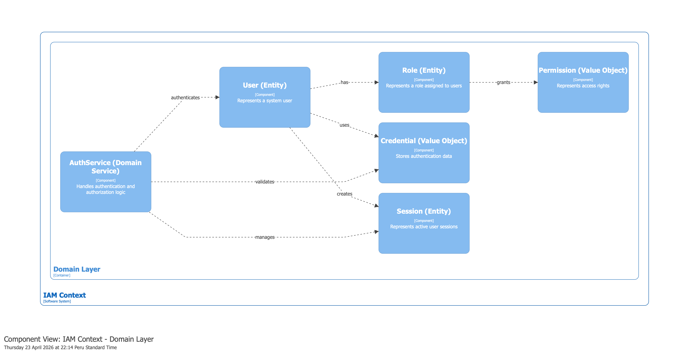

##### 2.6.1.6.2. Bounded Context Database Design Diagram

    

