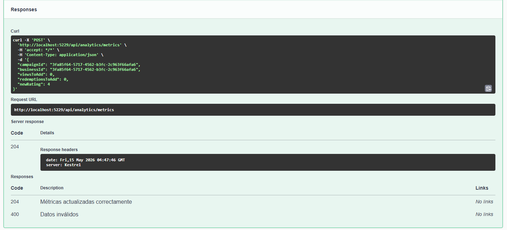
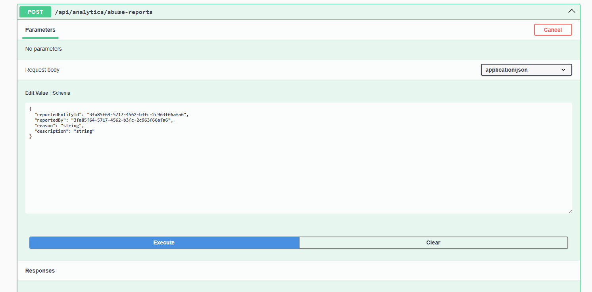
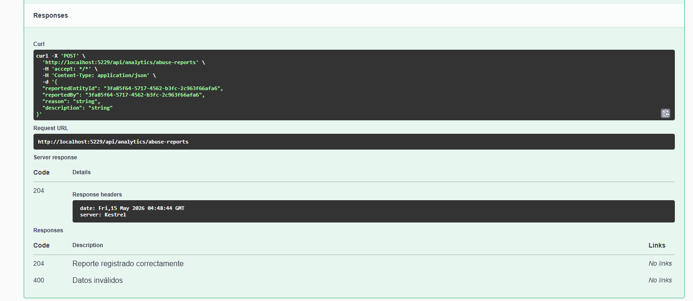
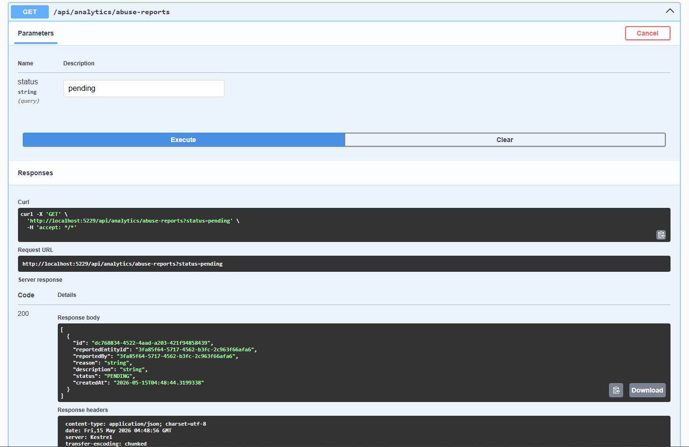

# Capítulo IV: Product Implementation & Validation

## 4.1 Software Configuration Management

### 4.1.1 Software Development Environment Configuration

### 4.2. Landing Page & Mobile Application Implementation
#### 4.2.1. Sprint n
##### 4.2.1.1. Sprint Planning n
##### 4.2.1.2. Sprint Backlog n
##### 4.2.1.3. Development Evidence for Sprint Review
##### 4.2.1.4. Testing Suite Evidence for Sprint Review
##### 4.2.1.5. Execution Evidence for Sprint Review

##### 4.2.1.6. Services Documentation Evidence for Sprint Review

## Analytics Bounded Context

Como parte del desarrollo del backend en C#, se ha consolidado el Bounded Context de **Analytics**. Este módulo es fundamental para la inteligencia de negocio de la aplicación, encargado de recopilar, procesar y exponer métricas del sistema, dashboards por negocio, estadísticas de campañas y reportes de abuso.

### Implementación Técnica de Analytics

Se ha estructurado la lógica para permitir que los negocios accedan a información clave sobre su desempeño y actividad. Los logros principales incluyen:

* **Gestión de Métricas:** Implementación de flujos para la actualización y consulta de métricas del sistema en tiempo real.
* **Dashboards por Negocio:** Capacidad para obtener un resumen consolidado del desempeño de cada negocio mediante su identificador único.
* **Métricas de Campaña:** Endpoints dedicados a la consulta de estadísticas específicas por campaña promocional.
* **Control de Abuso:** Registro y consulta de reportes de abuso, permitiendo una supervisión activa del uso de la plataforma.

---

## Evidencias de Ejecución: Módulo Analytics

A continuación se presentan los endpoints desarrollados y testeados a través de la interfaz de Swagger:

### 1. Gestión de Analytics

El controlador de **Analytics** expone las funcionalidades críticas para el monitoreo y análisis del sistema:

* **Endpoints de Analytics**: Permite a los negocios consultar su desempeño y al sistema registrar eventos relevantes.

- **Actualización de Métricas del Sistema**

    

    

- **Dashboard por Negocio**
  

    

- **Métricas de Campaña**

    

- **Registro de Reportes de Abuso**

    

    

- **Consulta de Reportes de Abuso**

    

##### 4.2.1.7. Software Deployment Evidence for Sprint Review
##### 4.2.1.8. Team Collaboration Insights during Sprint
### 4.3. Validation Interviews
#### 4.3.1. Diseño de Entrevistas
#### 4.3.2. Registro de Entrevistas
#### 4.3.3. Evaluaciones según heurísticas
